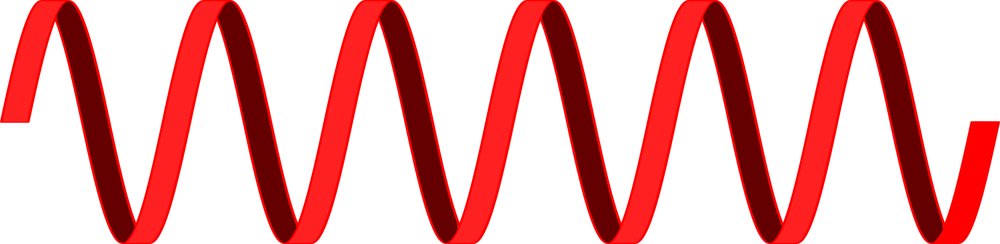
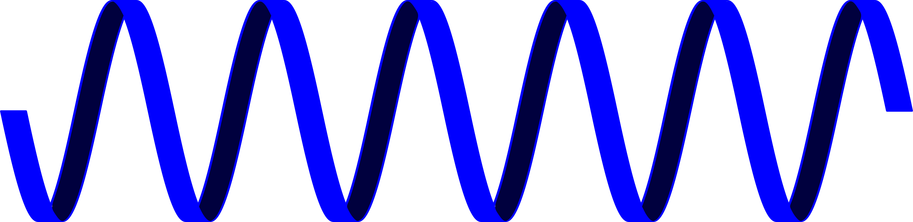
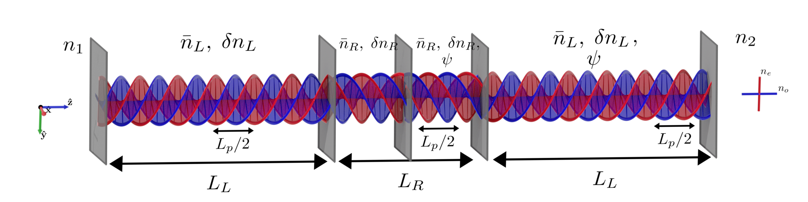

**Acknowledgements**

Thanks

Introduction
============

Background
==========

This chapter aims bring the definitions, fundamental theory as well as a
review of related experimental work on chiral media in optics. The
theory is derived entirely, under the form of an exact method (Oseen
method) and an approximate method (Coupled Wave Theory).

Definitions and notations
-------------------------

### Description of the medium, Maxwell equations and electromagnetic field

This study focuses on studying the propagation of plane waves in media
presenting an anisotropic permittivity $\epsilon_0\bm{\epsilon}$, with
$\bm{\epsilon}$ given in equation
[\[eq:epsilon\]](#eq:epsilon){reference-type="ref"
reference="eq:epsilon"}.
$$\bm{\epsilon} = \begin{pmatrix}\bm{R}^{-1}(pz+\psi)\cdot\begin{pmatrix}
\epsilon_a & 0\\
0 & \epsilon_b\\
\end{pmatrix}\cdot\bm{R}(pz+\psi) & \begin{matrix}
0\\0
\end{matrix}\\
\begin{matrix}
0 & 0
\end{matrix} & \epsilon_c
\end{pmatrix}
\label{eq:epsilon}$$ Where $\bm{R}$ is a rotation matrix. Rotations in
the plane, of angle $\varphi$, are described by the orthogonal matrix
$\bm{R}(\varphi)$ in equation
[\[eq:rotation\]](#eq:rotation){reference-type="ref"
reference="eq:rotation"}. $z$ is the position in the medium, $p$ the
periodicity of the rotation, $\psi$ the phase of the rotation at the
origin and $\epsilon_{a,b,c}$ are relative permittivities. The medium
can therefore be understood as a birefringent medium whose axes are
rotated in the $x,y$ plane for each position on the $z$ axis.
Experimental realisations of such media are presented in section
[2.4](#sec:experimental_work){reference-type="ref"
reference="sec:experimental_work"}.

$$\bm{R}(\varphi) = \begin{pmatrix}
\cos(\varphi) & -\sin(\varphi)\\
\sin(\varphi) & \cos(\varphi)
\end{pmatrix} \label{eq:rotation}$$

This allows to write Maxwell-Faraday and Maxwell-Ampère laws in a
dielectric for $\bm{E}$ and $\bm{B}$ as in equations
[\[eq:faraday\]](#eq:faraday){reference-type="ref"
reference="eq:faraday"} and
[\[eq:ampere\]](#eq:ampere){reference-type="ref" reference="eq:ampere"}.
$$\begin{aligned}
\nabla \times\bm{E} &=& -\mu_0\pdv{\bm{H}}{t}\label{eq:faraday}\\
\nabla \times\bm{H} &=& \epsilon_0\bm{\epsilon}\cdot\pdv{\bm{E}}{t}\label{eq:ampere}\end{aligned}$$
In order to study the effects of the anisotropy, we consider only the
derivative against $z$ of the cross-products, leading to equations
[\[eq:de\_h\]](#eq:de_h){reference-type="ref" reference="eq:de_h"} and
[\[eq:dh\_e\]](#eq:dh_e){reference-type="ref" reference="eq:dh_e"}.
$$\begin{aligned}
\bm{\hat{z}}\dv{z}\times\bm{E}_\perp &=& ik_0\bm{H}'_\perp \label{eq:de_h}\\
\bm{\hat{z}}\dv{z}\times\bm{H}'_\perp &=& -ik_0\bm{\epsilon}_\perp\cdot\bm{E}_\perp \label{eq:dh_e}\end{aligned}$$
Where the notation $\perp$ is used to refer to the sub-vector of the
field in $x,y$ plane or the components of the sub-matrices dealing with
components of the field in that plane[^1]. We also make use of a reduced
$\bm{H}$ field, $\bm{H'}$, defined in equation
[\[eq:hp\]](#eq:hp){reference-type="ref" reference="eq:hp"}.
$$\begin{aligned}
\bm{H}' &=& \left(\frac{\mu_0}{\epsilon_0}\right)^{1/2}\bm{H} \label{eq:hp}\end{aligned}$$

### Handedness {#seq:handedness}

The chosen definition used for handedness of polarization is that the
field is said to be left-handed (respectively right-handed) if the helix
it describes is left-handed (respectively right-handed). This definition
does not depend on the direction of propagation. Figure
[\[fig:handedness\]](#fig:handedness){reference-type="ref"
reference="fig:handedness"} illustrates the two possible handedness.

Formally, this means that in equation
[\[eq:epsilon\]](#eq:epsilon){reference-type="ref"
reference="eq:epsilon"}, a right-handed medium would have a positive
value of $p$ while a left-handed one would have a negative one.

{width="\textwidth"}

[\[fig:left\_handed\]]{#fig:left_handed label="fig:left_handed"}

{width="\textwidth"}

[\[fig:right\_handed\]]{#fig:right_handed label="fig:right_handed"}

### Transfer matrices and bases for the field

The cavity configurations explored in this report are described with the
help of transfer matrices. Three bases are used in order to describe the
field.

Electromagnetic basis

:   The field is represented under the form
    $\left[E_x, E_y, H'_x, H'_y\right]^T$. Continuity of tangential
    components of the field allows to directly multiply two matrices
    describing two media to get the matrix describing the two media
    combined. However this representation does not give a direct image
    of the components of the field propagating forward or backward in
    the medium.

Cartesian basis

:   The field is written in the form
    $\left[E_x^+, E_y^+, E_x^-, E_y^-\right]^T$. This base allows to
    directly represent the field direction. However, the media studied
    induce circularly polarised field. This field is mainly used as a
    transition between electromagnetic and circular bases.

Circular basis

:   This is the basis of main interest for this study. The two main
    vectors are $\bm{e_1}$ and $\bm{e_2}$, given by equations
    [\[eq:e1\]](#eq:e1){reference-type="ref" reference="eq:e1"} and
    [\[eq:e2\]](#eq:e2){reference-type="ref" reference="eq:e2"}. The
    field is written $\left[E_L^+, E_R^+, E_L^-, E_R^-\right]^T$.
    $$\begin{aligned}
    	\bm{e_1} &=& \frac{1}{\sqrt{2}}\begin{bmatrix}
    	1\\i
    	\end{bmatrix}\label{eq:e1}\\
    	\bm{e_2} &=& \frac{1}{\sqrt{2}}\begin{bmatrix}
    	1\\-i
    	\end{bmatrix}\label{eq:e2}
    	\end{aligned}$$

It is worth to note that $\bm{E}$ can be retrieved easily, independently
from the medium *via* equation [\[eq:E\]](#eq:E){reference-type="ref"
reference="eq:E"}.
$$\bm{E} = \underbrace{E_L^+\bm{e_1}+E_R^+\bm{e_2}}_{=\begin{bmatrix}E_x^+\\E_y^+\end{bmatrix}}+\underbrace{E_L^-\bm{e_2}+E_R^-\bm{e_1}}_{=\begin{bmatrix}E_x^-\\E_y^-\end{bmatrix}}\label{eq:E}$$
$\bm{H'}$ however is more difficult to calculate, and depends on the
medium and the method used to simulate it.

### Partial inverse and reflection coefficients {#sec:reflection}

One interesting feature of transfer matrices is that they allow the
calculation of reflectivity quite easily, allowing to compare
reflectivities with known results[@mccall_simplified_2009]. This
subsection introduce a systematic way of expressing those coefficients,
using partial inverses of matrices[@noauthor_partial_2020].

If a matrix $\bm{M}$ links a state of light 0 to a state of light 1
(*e.g.* for an interface or the propagation through a slab of chiral
medium), *i.e.*
$\left[E_a, E_b, E_c, E_d\right]^T_{1} = \bm{M}\left[E_a, E_b, E_c, E_d\right]^T_{0}$,
$\bm{M}$ can be rewritten by blocks $$\begin{bmatrix}
E_a^+ \\
E_b^+ \\
E_a^- \\
E_b^- \\
\end{bmatrix}_{1} = \begin{pmatrix}
\bm{M_{11}} & \bm{M_{12}}\\
\bm{M_{21}} & \bm{M_{22}}\\
\end{pmatrix}\begin{bmatrix}
E_a^+ \\
E_b^+ \\
E_a^- \\
E_b^- \\
\end{bmatrix}_{0}$$ By defining the partial inverse of $\bm{M}$,
$\text{inv}_1(\bm{M})$, as $$\text{inv}_1(\bm{M}) = \begin{pmatrix}
\bm{M_{11}}^{-1} & -\bm{M_{11}}^{-1}\bm{M_{12}}\\
\bm{M_{21}}\bm{M_{11}}^{-1} & \bm{M_{22}}-\bm{M_{21}}\bm{M_{11}}^{-1}\bm{M_{12}}\\
\end{pmatrix}$$ We get $$\begin{bmatrix}
E_{a,1}^+ \\
E_{b,1}^+ \\
E_{a,0}^- \\
E_{b,0}^- \\
\end{bmatrix} = \left(\text{inv}_1(\bm{M})\right)^{-1}\begin{bmatrix}
E_{a,0}^+ \\
E_{b,0}^+ \\
E_{a,1}^- \\
E_{b,1}^- \\
\end{bmatrix}\label{eq:pinv}$$ Thus by knowing the boundary conditions
$[E_{a,0}^+, E_{b,0}^+, E_{a,1}^-, E_{b,1}^-]^T$, it is possible to know
the reflected and transmitted field
$[E_{a,1}^+,E_{b,1}^+,E_{a,0}^-,E_{a,0}^-]^T$.

By setting $[E_{a,1}^-, E_{b,1}^-] = \bm{0}$ in equation
[\[eq:pinv\]](#eq:pinv){reference-type="ref" reference="eq:pinv"}[^2],
it is straightforward to see that the amplitude reflection and
transmission coefficients associated to $\bm{M}$ are given by the first
two columns of $\left(\text{inv}_1(\bm{M})\right)^{-1}$.
$$\left(\text{inv}_1(\bm{M})\right)^{-1} = \begin{pmatrix}
t_{aa} & t_{ab} & \ldots \\
t_{ba} & t_{bb} & \ldots \\
r_{aa} & r_{ab} & \ldots \\
r_{ba} & r_{bb} &  \ldots\\
\end{pmatrix}$$ This allows to express directly the reflection and
transmission coefficients.

$$\begin{aligned}
\begin{pmatrix}
t_{aa} & t_{ab} \\
t_{ba} & t_{bb}
\end{pmatrix} &=& \bm{M_{11}} - \bm{M_{12}}\bm{M_{22}}^{-1}\bm{M_{21}} \label{eq:transmission}\\
\begin{pmatrix}
r_{aa} & r_{ab} \\
r_{ba} & r_{bb}
\end{pmatrix} &=& -\bm{M_{22}}^{-1}\bm{M_{21}}\label{eq:reflection}\end{aligned}$$

### Energy conservation

From the reflection coefficients, it is possible to check energy
conservation in the medium. Three criterion can be
distinguished[@mccall_properties_2009]. Expressing reflection
coefficients in an arbitrary basis as in section
[2.1.4](#sec:reflection){reference-type="ref"
reference="sec:reflection"}, equations
[\[eq:energyconservationa\]](#eq:energyconservationa){reference-type="ref"
reference="eq:energyconservationa"} and
[\[eq:energyconservationb\]](#eq:energyconservationb){reference-type="ref"
reference="eq:energyconservationb"} correspond to energy conservation
for light incident to the medium with polarisation states $a$ and $b$
respectively. Equation
[\[eq:energyconservationredistribution\]](#eq:energyconservationredistribution){reference-type="ref"
reference="eq:energyconservationredistribution"} accounts for
redistribution of energy between polarization states $a$ and $b$. $n1$
and $n2$ are the refractive indices of the isotropic media before and
after the chiral medium.

$$\begin{aligned}
\abs{r_{aa}}^2+\abs{r_{ba}}^2+\left(\frac{n_2}{n_1}\right)(\abs{t_{aa}}^2+\abs{t_{ba}}^2)-1&=&0\label{eq:energyconservationa}\\
\abs{r_{ab}}^2+\abs{r_{bb}}^2+\left(\frac{n_2}{n_1}\right)(\abs{t_{ab}}^2+\abs{t_{bb}}^2)-1&=&0\label{eq:energyconservationb}\\
r_{aa}r_{ab}^*+r_{ba}r_{bb}^*+\left(\frac{n_2}{n_1}\right)(t_{aa}t_{ab}^*+t_{ba}t_{bb}^*) &=& 0 \label{eq:energyconservationredistribution}\end{aligned}$$

Oseen transformation
--------------------

The Oseen transformation allows to give an exact solution for the
electromagnetic fields in a chiral medium, although it does not yields
an explicit form of the propagation matrix.

### Derivation of transfer matrix equation

The main idea behind this method is to use a well-chosen change of
basis, named \"the Oseen transformation\", described by equation
[\[eq:oseen\_transformation\]](#eq:oseen_transformation){reference-type="ref"
reference="eq:oseen_transformation"}.

$$\begin{aligned}
\bm{e}(z) = \bm{R}^{-1}(z)\cdot\bm{E}_\perp(z) &,& \bm{h}(z) = \bm{R}^{-1}(z)\cdot\bm{H}'_\perp(z) \label{eq:oseen_transformation}\end{aligned}$$
By rewriting equations [\[eq:de\_h\]](#eq:de_h){reference-type="ref"
reference="eq:de_h"} and [\[eq:dh\_e\]](#eq:dh_e){reference-type="ref"
reference="eq:dh_e"} as follow: $$\begin{aligned}
\dv{z}\bm{E}_\perp = ik_0\begin{pmatrix}
0 & 1\\-1 & 0
\end{pmatrix}\bm{H}'_\perp&,&
\dv{z}\bm{H}'_\perp = -ik_0\begin{pmatrix}
0 & 1\\-1 & 0
\end{pmatrix}\bm{\epsilon}\bm{E}_\perp\end{aligned}$$ and noting that
$\dv{z}\bm{R}^{-1} = p\begin{pmatrix}
0 & 1 \\ -1 & 0
\end{pmatrix} \bm{R}^{-1}$, these two intermediate quantities must
therefore verify equation
[\[eq:oseen\_intermediate\]](#eq:oseen_intermediate){reference-type="ref"
reference="eq:oseen_intermediate"}.

$$\begin{aligned}
\dv{z}\begin{bmatrix}
e_x\\e_y\\h_x\\h_y
\end{bmatrix} = i\underbrace{\begin{pmatrix}
	0 & -ip & 0 & k_0\\
	ip & 0 & -k_0 & 0\\
	0 & -k_0\epsilon_b & 0 & -ip\\
	k_0\epsilon_a & 0 & ip & 0\\
	\end{pmatrix}}_{=\bm{G}}\begin{bmatrix}
e_x\\e_y\\h_x\\h_y
\end{bmatrix} \label{eq:oseen_intermediate}\end{aligned}$$ Remarkably,
equation
[\[eq:oseen\_intermediate\]](#eq:oseen_intermediate){reference-type="ref"
reference="eq:oseen_intermediate"} does not depend on the position.
Thus, it is simply soluble with an matrix exponential. Then, taking into
account the change of basis, this yields an exact solution for $\bm{E}$
and $\bm{H'}$, given in equation
[\[eq:oseen\]](#eq:oseen){reference-type="ref" reference="eq:oseen"}.
$$\begin{bmatrix}
E_x\\E_y\\H'_x\\H'_y
\end{bmatrix}_{z=d} = \underbrace{\begin{pmatrix}
	\bm{R}(d) & 0\\0 & \bm{R}(d)
	\end{pmatrix}e^{i\bm{G}d}\begin{pmatrix}
		\bm{R}^{-1}(0) & 0\\0 & \bm{R}^{-1}(0)
		\end{pmatrix}}_{=\bm{M_o}}\begin{bmatrix}
E_x\\E_y\\H'_x\\H'_y
\end{bmatrix}_{z=0} \label{eq:oseen}$$ In equation
[\[eq:oseen\]](#eq:oseen){reference-type="ref" reference="eq:oseen"},
$\bm{M_o}$ is the transfer matrix associated to the Oseen method in the
electromagnetic basis.

### Change of basis {#sec:chg_basis_oseen}

The expression given in equation
[\[eq:oseen\]](#eq:oseen){reference-type="ref" reference="eq:oseen"} is
in the electromagnetic basis. In order to use equations
[\[eq:transmission\]](#eq:transmission){reference-type="ref"
reference="eq:transmission"} and
[\[eq:reflection\]](#eq:reflection){reference-type="ref"
reference="eq:reflection"} and get transmission and reflection
coefficients for circular components of light, it is required to be able
to express the transmission matrix in the circular basis.

Changing basis in inside the chiral medium would be troublesome.
Thankfully it is easier to do so in an isotropic medium, and that is
enough to express the reflection coefficients of a slice of chiral
medium. Equation [\[eq:oseen\]](#eq:oseen){reference-type="ref"
reference="eq:oseen"} is rewritten

$$\begin{aligned}
\begin{bmatrix}
E_x^+\\E_y^+\\-n_2 E_y^+\\n_2 E_x^+
\end{bmatrix}_L &=& \bm{M_o}\begin{bmatrix}
E_x^+ + E_x^-\\E_y^+ + E_y^-\\-n_1(E_y^+ - E_y^-)\\n_1(E_x^+ - E_x^-)
\end{bmatrix}_0\\
&=&\bm{M_o}\begin{pmatrix}
1 & 0 & 1 & 0\\
0 & 1 & 0 & 1\\
0 & -n_1 & 0 & n_1\\
n_1 & 0 & -n_1 & 0
\end{pmatrix}\begin{bmatrix}
E_x^+\\E_y^+\\E_x^-\\E_y^-
\end{bmatrix}_0\\
\begin{bmatrix}
E_x^+\\E_y^+\\E_x^-\\E_y^-
\end{bmatrix}_L &=&\underbrace{\begin{pmatrix}
1 & 0 & 1 & 0\\
0 & 1 & 0 & 1\\
0 & -n_2 & 0 & n_2\\
n_2 & 0 & -n_2 & 0
\end{pmatrix}^{-1}\bm{M_o}\begin{pmatrix}
1 & 0 & 1 & 0\\
0 & 1 & 0 & 1\\
0 & -n_1 & 0 & n_1\\
n_1 & 0 & -n_1 & 0
\end{pmatrix}}_{=\bm{M_o^{\text{Cart}}}}\begin{bmatrix}
E_x^+\\E_y^+\\E_x^-\\E_y^-
\end{bmatrix}_0\end{aligned}$$ In isotropic medium it is straightforward
to link Then, equation [\[eq:dh\_e\]](#eq:dh_e){reference-type="ref"
reference="eq:dh_e"} and the definition of $E^\pm_{R,L}$ in isotropic
medium give $$\begin{aligned}
\begin{bmatrix}
E_x^+\\E_y^+\\E_x^-\\E_y^-
\end{bmatrix} &=& \frac{1}{\sqrt{2}}\begin{pmatrix}
1 & 1 & 0 & 0\\
i & -i & 0 & 0\\
0 & 0 & 1 & 1\\
0 & 0 & -i & i
\end{pmatrix}\begin{bmatrix}
E_L^+\\E_R^+\\E_L^-\\E_R^-
\end{bmatrix}\\
\begin{bmatrix}
E_L^+\\E_R^+\\E_L^-\\E_R^-
\end{bmatrix} &=& \sqrt{2}\begin{pmatrix}
1 & -i & 0 & 0\\
1 & i & 0 & 0\\
0 & 0 & 1 & i\\
0 & 0 & 1 & -i
\end{pmatrix}\begin{bmatrix}
E_x^+\\E_y^+\\E_x^-\\E_y^-
\end{bmatrix}\end{aligned}$$ Then the transmission matrix in circular
basis, $\bm{M_o^{\text{Circ}}}$, is defined as follow $$\begin{aligned}
\bm{M_o^{\text{Circ}}} &=& \begin{pmatrix}
1 & -i & 0 & 0\\
1 & i & 0 & 0\\
0 & 0 & 1 & i\\
0 & 0 & 1 & -i
\end{pmatrix}\bm{M_o^{\text{Cart}}}\begin{pmatrix}
1 & 1 & 0 & 0\\
i & -i & 0 & 0\\
0 & 0 & 1 & 1\\
0 & 0 & -i & i
\end{pmatrix}\end{aligned}$$ It is then possible to calculate the
transmission coefficients using equations
[\[eq:transmission\]](#eq:transmission){reference-type="ref"
reference="eq:transmission"} and
[\[eq:reflection\]](#eq:reflection){reference-type="ref"
reference="eq:reflection"}.

Coupled Waves Theory {#sec:cwt}
--------------------

$\bm{M_o}$ defined in equation
[\[eq:oseen\]](#eq:oseen){reference-type="ref" reference="eq:oseen"}
does not give an analytical expression that is easy to use. This section
develops an approximate theory that gives simple analytic expressions,
using the material present in [@mccall_properties_2009], and extending
the theory to left-handed in addition to right-handed media, and
deriving the corresponding matrices for the interfaces between chiral
media and isotropic or chiral media.

### Matrix for a piece of chiral medium in circular basis

The coupled wave theory is expressed naturally in the circular basis.
This section includes an extensive derivation of this theory, based on
[@mccall_photonics_2020] and [@mccall_simplified_2009]. This also
includes a derivation of the transfer matrices for left-handed media
that was not available in previous
studies[@mccall_simplified_2009][@mccall_properties_2009] but is needed
for this study.

#### Derivation of CWT equations

Calculating the curl of equation
[\[eq:faraday\]](#eq:faraday){reference-type="ref"
reference="eq:faraday"} yields
$$\nabla \times \nabla \times\bm{E} = -\mu_0\pdv{\nabla\bm{H}}{t} = -\mu_0\epsilon_0\bm{\epsilon}\cdot\pdv[2]{\bm{E}}{t}$$
Using the vector identity
$\nabla\times\nabla\times \bm{A} = \nabla(\nabla\cdot\bm{A}) - \nabla^2\bm{A}$,
this yields the 3D Helmholtz equation.
$$-\nabla^2\bm{E} + \nabla(\nabla\cdot\bm{E}) = -\mu_0\epsilon_0\bm{\epsilon}\cdot\pdv[2]{\bm{E}}{t}$$
For a dielectric, $\nabla\cdot\bm{E}=0$. Projecting $\bm{E}$ in the
Fourier domain gives $\pdv[2]{\bm{E}}{t}=-\omega^2\bm{E}$. Thus, taking
only interest in $\bm{E}_\perp$, this yields the one-dimensional
Helmholtz equation, where $k_0^2=\mu_0\epsilon_0\omega^2$.
$$\dv[2]{\mathbf{E}_\perp}{z} + k_0^2 \bm{\epsilon}\cdot\mathbf{E}_\perp = 0 \label{eq:helmholtz}$$
With
$\bm{\epsilon}_\perp = \mathbf{R}(z)\text{diag}(\epsilon_a, \epsilon_b)\mathbf{R}(z)^{-1}$
the anisotropic permittivity defined earlier. Defining
$n_{a,b}=\sqrt{\epsilon_{a,b}}$, we can decompose $\mathbf{E}_\perp$ as
$$\begin{aligned}
	\mathbf{E}_\perp &=& \mathbf{A^+}e^{ikz} + \mathbf{A^-}e^{-ikz}\\
	&=&   A_L^+e^{ikz} \underbrace{\frac{1}{\sqrt{2}}\begin{bmatrix}1\\i\end{bmatrix}}_{=\mathbf{e_1}} + A_R^+e^{ikz} \underbrace{\frac{1}{\sqrt{2}}\begin{bmatrix}1\\-i\end{bmatrix}}_{=\mathbf{e_2}} + A_L^-e^{-ikz} \underbrace{\frac{1}{\sqrt{2}}\begin{bmatrix}1\\-i\end{bmatrix}}_{=\mathbf{e_2}} + A_R^-e^{-ikz} \underbrace{\frac{1}{\sqrt{2}}\begin{bmatrix}1\\i\end{bmatrix}}_{=\mathbf{e_1}} \end{aligned}$$
and $\mathbf{R}$ as in equation [\[eq:R\]](#eq:R){reference-type="ref"
reference="eq:R"}.
$$\mathbf{R} = \underbrace{\frac{1}{2}\begin{pmatrix}1&i\\-i&1\end{pmatrix}}_{=\bm{\sigma}}e^{i(pz + \psi)} + \underbrace{\frac{1}{2}\begin{pmatrix}1&-i\\i&1\end{pmatrix}}_{=\bm{\sigma}^*}e^{-i(pz+\psi)} \label{eq:R}$$
Then, denoting $\mathbf{S}=\begin{pmatrix}1 & 0\\0&-1\end{pmatrix}$, we
have
$$\bm{\epsilon} = \bm{R}\left(\bar{\epsilon}\mathbf{I} + \delta\epsilon \mathbf{S}\right)\bm{R}^{-1} \label{eq:espilon_decomp}$$
with $\bar{\epsilon}=\frac{\epsilon_a+\epsilon_b}{2}$ and
$\delta\epsilon=\frac{\epsilon_a-\epsilon_b}{2}$. This allows to
introduce the average refractive index and the birefringence of the
medium, respectively
$\bar{n} = \sqrt{\bar{\epsilon}} \approx \frac{n_a+n_b}{2}$ and
$\delta n = n_a - n_b$. With this definition,
$\delta\epsilon = \frac{(n_a + n_b)(n_a - n_b)}{2} \approx \bar{n}\delta n$.

Before getting further, it is useful to note some algebraic properties
of $\bm{\sigma}$, $\bm{\sigma}^*$. $$\begin{aligned}
	\bm{\sigma}^2 = \bm{\sigma} &,&\bm{\sigma}^{*2} = \bm{\sigma}^* \\
	\bm{\sigma}\bm{\sigma}^* = 0 &,& \bm{\sigma}^*\bm{\sigma} = 0 \\
	\bm{\sigma} + \bm{\sigma}^* = \bm{I}\end{aligned}$$ This allows
equation
[\[eq:espilon\_decomp\]](#eq:espilon_decomp){reference-type="ref"
reference="eq:espilon_decomp"} to be rewritten as follow
$$\bm{\epsilon} = \bar{\epsilon}\bm{I} + \delta\epsilon\left(\bm{\sigma}\bm{S}\bm{\sigma}^*e^{2i(pz+\psi)} + \bm{\sigma}^*\bm{S}\bm{\sigma}e^{-2i(pz+\psi)}\right) \label{eq:epsilonsigma}$$
Then, to calculate $k_0^2\bm{\epsilon}\cdot\bm{E}_\perp$, it can be
noted that that $$\begin{aligned}
	\bm{\sigma}\bm{S}\bm{\sigma}^*\cdot\bm{e_1}=\bm{e_2} &,& \bm{\sigma}\bm{S}\bm{\sigma}^*\cdot\bm{e_2}=0 \\
	\bm{\sigma}^*\bm{S}\bm{\sigma}\cdot\bm{e_1}=0 &,& \bm{\sigma}^*\bm{S}\bm{\sigma}\cdot\bm{e_2}=\bm{e_1}\end{aligned}$$
Moreover, as for right-handed media $p>0$, terms with an argument of
$\pm i(2p+k)z$ will not be phase matched, meaning that their overall
contribution over the medium is negligible. This yields equation
[\[eq:helmholtz\_rhs\]](#eq:helmholtz_rhs){reference-type="ref"
reference="eq:helmholtz_rhs"}, introducing $k^2=k_0^2\bar{n}^2$.
$$k_0^2\bm{\epsilon}\cdot\bm{E}_\perp = \underbrace{k_0^2\bar{\epsilon}}_{=k^2}\bm{E}_\perp + k_0^2\delta\epsilon\left(A_R^-e^{i[(2p-k)z+2\psi]}\bm{e_2} + A_R^+e^{-i[(2p-k)z+2\psi]}\bm{e_1}\right)\label{eq:helmholtz_rhs}$$
Then, in the slow varying envelop approximation, second order
derivatives of the envelop can be neglected, yielding equation
[\[eq:helmholtz\_lhs\]](#eq:helmholtz_lhs){reference-type="ref"
reference="eq:helmholtz_lhs"}.
$$\dv[2]{\bm{E}_\perp}{z} \approx 2ik \left( \dv{z}A_L^+e^{ikz}\bm{e_1} + \dv{z}A_R^+e^{ikz}\bm{e_2} - \dv{z}A_L^-e^{-ikz}\bm{e_2} - \dv{z}A_R^-e^{-ikz}\bm{e_1}\right) - k^2\bm{E}_\perp \label{eq:helmholtz_lhs}$$
Combining equations
[\[eq:helmholtz\_rhs\]](#eq:helmholtz_rhs){reference-type="ref"
reference="eq:helmholtz_rhs"} and
[\[eq:helmholtz\_lhs\]](#eq:helmholtz_lhs){reference-type="ref"
reference="eq:helmholtz_lhs"} and projecting on the circular basis and
equating phase-matched terms gives equation
[\[eq:cwt\_de\]](#eq:cwt_de){reference-type="ref"
reference="eq:cwt_de"}.

$$\begin{aligned}
	&&\left\{
	\begin{matrix}
	0&=&2ik\dv{z}A_L^+ e^{ikz}\\
	0&=&2ik\dv{z}A_R^+ e^{ikz} + k_0^2\delta \epsilon A_R^- e^{i[(2p-k)z+2\psi]}\\
	0&=&-2ik\dv{z}A_L^- e^{-ikz}\\
	0&=&-2ik\dv{z}A_R^- e^{-ikz} + k_0^2\delta \epsilon A_R^+ e^{-i[(2p-k)z+2\psi]}\\
	\end{matrix}\right.\\
	\dv{z}\begin{bmatrix}
	A_L^+ \\
	A_R^+ \\
	A_L^- \\
	A_R^- \\
	\end{bmatrix} &=&
	\begin{pmatrix}
	0 & 0 & 0 & 0 \\
	0 & 0 & 0 & i\kappa e^{i(2\psi - \delta kz)} \\
	0 & 0 & 0 & 0 \\
	0 & -i\kappa e^{-i(2\psi - \delta kz)} & 0 & 0
	\end{pmatrix}
	\begin{bmatrix}
	A_L^+ \\
	A_R^+ \\
	A_L^- \\
	A_R^- \\
	\end{bmatrix}
	\label{eq:cwt_de}\end{aligned}$$ Where $\delta k = 2(k-p)$ and
$\kappa=\frac{k_0\delta\epsilon}{2\bar{n}}\approx\frac{\pi\delta n}{\lambda_0}$.
If the medium considered was left-handed ($p<0$), then terms in
$\pm i(2p-k)z$ would be neglected, and equation
[\[eq:cwt\_de\]](#eq:cwt_de){reference-type="ref" reference="eq:cwt_de"}
would become equation
[\[eq:cwt\_de\_lh\]](#eq:cwt_de_lh){reference-type="ref"
reference="eq:cwt_de_lh"} where $\delta k = 2(k+p)$ and $\kappa$ is
unchanged.

$$\dv{z}\begin{bmatrix}
	A_L^+ \\
	A_R^+ \\
	A_L^- \\
	A_R^- \\
	\end{bmatrix} =
	\begin{pmatrix}
	0 & 0 & i\kappa e^{-i(2\psi + \delta kz)} & 0 \\
	0 & 0 & 0 & 0 \\
	-i\kappa e^{i(2\psi + \delta kz)}  & 0 & 0 & 0 \\
	0& 0 & 0 & 0
	\end{pmatrix}
	\begin{bmatrix}
	A_L^+ \\
	A_R^+ \\
	A_L^- \\
	A_R^- \\
	\end{bmatrix}
	\label{eq:cwt_de_lh}$$

#### Solution to CWT equation

Equations [\[eq:cwt\_de\]](#eq:cwt_de){reference-type="ref"
reference="eq:cwt_de"} and
[\[eq:cwt\_de\_lh\]](#eq:cwt_de_lh){reference-type="ref"
reference="eq:cwt_de_lh"} are solved focusing on non trivial
derivatives. They can be rewritten
$$\dv{z}\bm{A}_{L,R} = \begin{pmatrix}0 & i\kappa e^{-2i\varphi(z)} \\ -i\kappa e^{2i\varphi(z)} & 0\end{pmatrix}\bm{A}_{L,R}$$
Where,

-   for a right handed medium, $\varphi(z) = \delta kz / 2 - \psi$ and
    $\bm{A}_R = \begin{bmatrix}A^+_R\\A^-_R\end{bmatrix}$;

-   for a left handed medium, $\varphi(z) = \delta kz / 2 + \psi$ and
    $\bm{A}_L = \begin{bmatrix}A^+_L\\A^-_L\end{bmatrix}$.

Then, defining
$\bm{\tilde{A}} = \underbrace{\begin{pmatrix}e^{i\varphi(z)} & 0 \\ 0 & e^{-i\varphi(z)}\end{pmatrix}}_{=\bm{\varphi}(z)}\bm{A}_{L,R}$
yields

$$\dv{z}\bm{\tilde{A}} = \underbrace{i\begin{pmatrix}\delta k / 2 & \kappa \\ -\kappa & -\delta k / 2\end{pmatrix}}_{=\bm{M}}\bm{\tilde{A}} \label{eq:x_tilde}$$
The characteristic polynomial of $\bm{M}$ is $\chi = X^2 - \Delta^2$,
with $\Delta = (\kappa^2 - (\delta k / 2)^2)$. Thus, when
$\Delta \neq 0$[^3], $\bm{M}$ is diagonalizable *via* a transformation
$\bm{P}$. Denoting $\bm{Y} = \bm{P}\bm{\tilde{A}}$, equation
[\[eq:x\_tilde\]](#eq:x_tilde){reference-type="ref"
reference="eq:x_tilde"} can be rewritten as in equation
[\[eq:y\]](#eq:y){reference-type="ref" reference="eq:y"}, introducing
$\bm{D}$.

$$\dv{z}\bm{Y} = \underbrace{\bm{P}\bm{M}\bm{P}^{-1}}_{=\bm{D}}\bm{Y}\label{eq:y}$$
The eigen values of $\bm{D}$ are the roots of $\chi$, *i.e.*
$\lambda_\pm = \pm \Delta$. Thus, equation
[\[eq:y\]](#eq:y){reference-type="ref" reference="eq:y"} can be solved :

$$\begin{aligned}
	\bm{Y} &=& \begin{pmatrix}
	e^{\Delta z} & 0\\
	0 & e^{-\Delta z}
	\end{pmatrix} \bm{Y_0}\\
	&=& \left[\cosh(\Delta z)\bm{I} + \sinh(\Delta z)\underbrace{\begin{pmatrix}
	1 & 0\\
	0 & -1
	\end{pmatrix}}_{\frac{1}{\Delta}\bm{D}}\right]\underbrace{\bm{Y_0}}_{=\bm{P}\bm{\tilde{A}_0}}\end{aligned}$$
This yields:

$$\bm{A}_{L,R} = \bm{\varphi}^{-1}(z) \bm{P}^{-1} \left[\cosh(\Delta z)\bm{I} + \frac{\sinh(\Delta z)}{\Delta}\bm{D}\right]\bm{P}\bm{\varphi}(0)\bm{A}_{L,R,0}$$
$$\bm{A}_{L,R} = \left[\cosh(\Delta z)\begin{pmatrix}
	e^{-i\frac{\delta kz}{2} } & 0 \\
	0 & e^{i\frac{\delta kz}{2}}
	\end{pmatrix} + i\frac{\sinh(\Delta z)}{\Delta}\begin{pmatrix}
	\frac{\delta k}{2} e^{-i\frac{\delta kz}{2}} & \kappa e^{-i(\varphi(z)+\varphi(0))}\\
	-\kappa e^{i(\varphi(z)+\varphi(0))} & - \frac{\delta k}{2} e^{i\frac{\delta kz}{2}}
	\end{pmatrix}\right]\bm{A}_{L,R,0}$$ Finally equations
[\[eq:cwt\_de\]](#eq:cwt_de){reference-type="ref" reference="eq:cwt_de"}
and [\[eq:cwt\_de\_lh\]](#eq:cwt_de_lh){reference-type="ref"
reference="eq:cwt_de_lh"} can be solved by equations
[\[eq:sol\_cwt\]](#eq:sol_cwt){reference-type="ref"
reference="eq:sol_cwt"} and
[\[eq:sol\_cwt\_lh\]](#eq:sol_cwt_lh){reference-type="ref"
reference="eq:sol_cwt_lh"} respectively. $$\begin{bmatrix}
	A_L^+ \\
	A_R^+ \\
	A_L^- \\
	A_R^- \\
	\end{bmatrix}_{z} = \begin{pmatrix}
	1 & 0 & 0 & 0 \\
	0 & \left[\cosh(\Delta z) + i \frac{\delta k}{2\Delta}\sinh(\Delta z)\right] e^{-i\frac{\delta kz}{2} }& 0 & i\frac{\kappa}{\Delta}\sinh(\Delta z) e^{-i(\varphi(z)+\varphi(0))} \\
	0 & 0 & 1 & 0 \\
	0 & -i \frac{\kappa}{\Delta}\sinh(\Delta z)e^{i(\varphi(z)+\varphi(0))} & 0 & \left[\cosh(\Delta z) - i \frac{\delta k 	}{2\Delta}\sinh(\Delta z)\right]e^{i\frac{\delta kz}{2} }
	\end{pmatrix}\begin{bmatrix}
	A_L^+ \\
	A_R^+ \\
	A_L^- \\
	A_R^- \\
	\end{bmatrix}_{z=0}	\label{eq:sol_cwt}$$ $$\begin{bmatrix}
A_L^+ \\
A_R^+ \\
A_L^- \\
A_R^- \\
\end{bmatrix}_{z} = \begin{pmatrix}
\left[\cosh(\Delta z) + i \frac{\delta k}{2\Delta}\sinh(\Delta z)\right] e^{-i\frac{\delta kz}{2} } & 0 & i\frac{\kappa}{\Delta}\sinh(\Delta z) e^{-i(\varphi(z)+\varphi(0))} & 0 \\
0 & 1 & 0 & 0 \\
-i \frac{\kappa}{\Delta}\sinh(\Delta z)e^{i(\varphi(z)+\varphi(0))} & 0 & \left[\cosh(\Delta z) - i \frac{\delta k 	}{2\Delta}\sinh(\Delta z)\right]e^{i\frac{\delta kz}{2} } & 0 \\
0 & 0 & 0 & 1
\end{pmatrix}\begin{bmatrix}
A_L^+ \\
A_R^+ \\
A_L^- \\
A_R^- \\
\end{bmatrix}_{z=0}	\label{eq:sol_cwt_lh}$$ In terms of $\bm{E}_\perp$
field, denoting $E_{L,R}^\pm=A_{R,L}^\pm e^{\pm ikz}$, for right-handed
media this can be written

$$\begin{bmatrix}
E_L^+ \\
E_R^+ \\
E_L^- \\
E_R^- \\
\end{bmatrix}_{z=d} = \underbrace{\begin{pmatrix}
e^{ikd} & 0 & 0 & 0 \\
0 & \mathcal{P}_R^+ & 0 & \mathcal{Q}_R^+ \\
0 & 0 & e^{-ikd} & 0 \\
0 & \mathcal{Q}_R^- & 0 & \mathcal{P}_R^-
\end{pmatrix}}_{\bm{M_{cwt}}}\begin{bmatrix}
E_L^+ \\
E_R^+ \\
E_L^- \\
E_R^- \\
\end{bmatrix}_{z=0} \label{eq:cwt}$$ with $$\begin{aligned}
	\mathcal{P}_R^\pm &=& \left[\cosh(\Delta d) \pm i \frac{\delta k}{2\Delta}\sinh(\Delta d)\right]e^{\pm ipd}\\
\mathcal{Q}_R^\pm &=& \pm i\frac{\kappa}{\Delta}\sinh(\Delta d) e^{\pm i(pd+2\psi)}\end{aligned}$$
For left-handed media the solution is written $$\begin{bmatrix}
E_L^+ \\
E_R^+ \\
E_L^- \\
E_R^- \\
\end{bmatrix}_{z=d} = \begin{pmatrix}
	\mathcal{P}^+_L & 0 & \mathcal{Q}_L^+ & 0 \\
	0 & e^{ikd} & 0 & 0 \\
	\mathcal{Q}_L^- & 0 & \mathcal{P}^-_L & 0 \\
	0 & 0 & 0 & e^{-ikd}
	\end{pmatrix}\begin{bmatrix}
E_L^+ \\
E_R^+ \\
E_L^- \\
E_R^- \\
\end{bmatrix}_{z=0} \label{eq:cwt_lh}$$ where $$\begin{aligned}
\mathcal{P}_L^\pm &=& \left[\cosh(\Delta d) \pm i \frac{\delta k}{2\Delta}\sinh(\Delta d)\right]e^{\mp ipd}\\
\mathcal{Q}_L^\pm &=& \pm i\frac{\kappa}{\Delta}\sinh(\Delta d) e^{\mp i(pd+2\psi)}\end{aligned}$$

#### Special case $\Delta=0$ {#sec:special_case}

The solution given above works under the hypothesis of $\Delta\neq0$.
The treatment for the special case $\Delta=0$ was not included in
[@mccall_photonics_2020], but for completeness, this section derives a
solution for this case.

There are two cases to consider: $\delta k/2 = \kappa$ and
$\delta k/2 = -\kappa$. This means equation
[\[eq:x\_tilde\]](#eq:x_tilde){reference-type="ref"
reference="eq:x_tilde"} can be rewritten into equation
[\[eq:x\_tilde\_M\]](#eq:x_tilde_M){reference-type="ref"
reference="eq:x_tilde_M"}.
$$\dv{z}\bm{\tilde{A}} = \bm{M}\bm{\tilde{A}} \label{eq:x_tilde_M}$$
Where $$\bm{M} \in \left\{i\kappa\begin{pmatrix}
	1 & 1\\-1 & -1
	\end{pmatrix},i\kappa\begin{pmatrix}
	-1 & 1\\-1 & 1
	\end{pmatrix}\right\}$$ $\bm{M}$ is independent of $z$ and is nilpotent
of degree 2. Thus, the solutions to equation
[\[eq:x\_tilde\_M\]](#eq:x_tilde_M){reference-type="ref"
reference="eq:x_tilde_M"} are given by equations
[\[eq:sol\_x\_tilde\_M\_pos\]](#eq:sol_x_tilde_M_pos){reference-type="ref"
reference="eq:sol_x_tilde_M_pos"} and
[\[eq:sol\_x\_tilde\_M\_neg\]](#eq:sol_x_tilde_M_neg){reference-type="ref"
reference="eq:sol_x_tilde_M_neg"} for $\delta k/2 = \pm\kappa$
respectively. $$\begin{aligned}
\bm{\tilde{A}} &=&\left(\begin{pmatrix}
1 & 0\\0 & 1
\end{pmatrix}+i\kappa z\begin{pmatrix}
1 & 1\\-1 & -1
\end{pmatrix}\right)\bm{\tilde{A}}_0\label{eq:sol_x_tilde_M_pos}\\
\bm{\tilde{A}} &=&\left(\begin{pmatrix}
1 & 0\\0 & 1
\end{pmatrix}+i\kappa z\begin{pmatrix}
-1 & 1\\-1 & 1
\end{pmatrix}\right)\bm{\tilde{A}}_0\label{eq:sol_x_tilde_M_neg}\end{aligned}$$
This means that it is possible to retrieve $\bm{E}_{L,R}$ (depending on
the handedness of the medium), using
$\bm{E}_{L,R}=\begin{pmatrix}e^{ikz}&0\\0&e^{-ikz}\end{pmatrix}\bm{\varphi}^{-1}(z)\bm{\tilde{A}}$.
$$\begin{aligned}
\bm{E}_{L} &=&\begin{pmatrix}
(1 +i\kappa z)e^{-ipz} & i\kappa z e^{-i(pz+2\psi)}\\-i\kappa z e^{i(pz+2\psi)} & (1-i\kappa z)e^{ipz}
\end{pmatrix}\bm{E}_{L,0}\label{eq:sol_delta0_EL_pos}\\
\bm{E}_{R} &=&\begin{pmatrix}
(1 +i\kappa z)e^{ipz} & i\kappa z e^{i(pz+2\psi)}\\-i\kappa z e^{-i(pz+2\psi)} & (1-i\kappa z)e^{-ipz}
\end{pmatrix}\bm{E}_{R,0}\label{eq:sol_delta0_ER_pos}\\
\bm{E}_{L} &=&\begin{pmatrix}
(1 -i\kappa z)e^{-ipz} & i\kappa z e^{-i(pz+2\psi)}\\-i\kappa z e^{i(pz+2\psi)} & (1+i\kappa z)e^{ipz}
\end{pmatrix}\bm{E}_{L,0}\label{eq:sol_delta0_EL_neg}\\
\bm{E}_{R} &=&\begin{pmatrix}
(1 -i\kappa z)e^{ipz} & i\kappa z e^{i(pz+2\psi)}\\-i\kappa z e^{-i(pz+2\psi)} & (1+i\kappa z)e^{-ipz}
\end{pmatrix}\bm{E}_{R,0}\label{eq:sol_delta0_ER_neg}\end{aligned}$$
Then, by calculating the limits of $\mathcal{P}$ and $\mathcal{Q}$ when
$\Delta$ tends towards 0, $$\begin{aligned}
	\lim_{\Delta\rightarrow 0} \mathcal{P}^\pm_R &=&  (1\pm i\frac{\delta k}{2}z)e^{\pm ipz}\\
	\lim_{\Delta\rightarrow 0} \mathcal{P}^\pm_L &=&  (1\pm i\frac{\delta k}{2}z)e^{\mp ipz}\\
	\lim_{\Delta\rightarrow 0} \mathcal{Q}^\pm_R &=&  \pm i\kappa ze^{\pm i(pz+2\psi)}\\
	\lim_{\Delta\rightarrow 0} \mathcal{Q}^\pm_L &=&  \pm i\kappa ze^{\mp i(pz+2\psi)}\end{aligned}$$
And since when $\Delta$ tends towards 0,
$\delta k/2 \rightarrow \pm\kappa$, equations
[\[eq:sol\_delta0\_EL\_pos\]](#eq:sol_delta0_EL_pos){reference-type="ref"
reference="eq:sol_delta0_EL_pos"},
[\[eq:sol\_delta0\_ER\_pos\]](#eq:sol_delta0_ER_pos){reference-type="ref"
reference="eq:sol_delta0_ER_pos"},
[\[eq:sol\_delta0\_EL\_neg\]](#eq:sol_delta0_EL_neg){reference-type="ref"
reference="eq:sol_delta0_EL_neg"} and
[\[eq:sol\_delta0\_ER\_neg\]](#eq:sol_delta0_ER_neg){reference-type="ref"
reference="eq:sol_delta0_ER_neg"} can be rewritten as follow.
$$\begin{aligned}
\bm{E}_L &=&\lim_{\Delta\rightarrow 0}\begin{pmatrix}
	\mathcal{P}^+_L & \mathcal{Q}^+_L\\
	\mathcal{Q}^-_L & \mathcal{P}^-_L
\end{pmatrix}\\
\bm{E}_R &=&\lim_{\Delta\rightarrow 0}\begin{pmatrix}
	\mathcal{P}^+_R & \mathcal{Q}^+_R\\
	\mathcal{Q}^-_R & \mathcal{P}^-_R
\end{pmatrix}\end{aligned}$$ That is to say, equations
[\[eq:cwt\]](#eq:cwt){reference-type="ref" reference="eq:cwt"} and
[\[eq:cwt\_lh\]](#eq:cwt_lh){reference-type="ref" reference="eq:cwt_lh"}
can be prolonged by continuity for $\Delta=0$.

### Change of basis {#change-of-basis}

To compare equation [\[eq:cwt\]](#eq:cwt){reference-type="ref"
reference="eq:cwt"} to the Oseen method, or to write continuity of E-H
fields at interfaces, the matrix must be expressed in the
$[E_x, E_y, H'_x, H'_y]^T$ basis. Using previous notations,
$$\begin{aligned}
\bm{E_\perp}=\begin{bmatrix}
E_x\\E_y
\end{bmatrix} &=& \left(E_L^+ + E_R^-\right)\bm{e_1} + \left(E_L^- + E_R^+\right)\bm{e_2} \\
&=& \frac{1}{\sqrt{2}}\begin{pmatrix}
1 & 1 & 1 & 1\\
i &-i &-i & i 
\end{pmatrix}\begin{bmatrix}
E_L^+\\E_R^+\\E_L^-\\E_R^-
\end{bmatrix}\end{aligned}$$ From equation
[\[eq:de\_h\]](#eq:de_h){reference-type="ref" reference="eq:de_h"},
$$\begin{aligned}
\mathbf{H_\perp^\prime} &=& -ik_0^{-1} \begin{vmatrix}
\mathbf{\hat{x}} & \mathbf{\hat{y}} & \mathbf{\hat{z}}\\
0 & 0 & \frac{d}{dz}\\
E_x & E_y & E_z
\end{vmatrix}\\ 
&=& k_0^{-1} \begin{pmatrix}
0 & i\\-i & 0
\end{pmatrix}\dv{z}\bm{E_\perp} \\
&=& \frac{1}{\sqrt{2}}k_0^{-1} \begin{pmatrix}
0 & i\\-i & 0
\end{pmatrix}\begin{pmatrix}
1 & 1 & 1 & 1\\
i &-i &-i & i 
\end{pmatrix}\dv{z}\begin{bmatrix}
E_L^+\\E_R^+\\E_L^-\\E_R^-
\end{bmatrix}\\
&=& \frac{1}{\sqrt{2}}k_0^{-1} \begin{pmatrix}-1 & 1 & 1 & -1\\-i & -i & -i & -i\end{pmatrix}\frac{d}{dz}\begin{bmatrix}
E_L^+\\E_R^+\\E_L^-\\E_R^-
\end{bmatrix}\end{aligned}$$ Then, using equation
[\[eq:cwt\_de\]](#eq:cwt_de){reference-type="ref" reference="eq:cwt_de"}
and writing the derivative of $E_{L,R}^{\pm}$ as the derivative of a
product, $$\begin{aligned}
\mathbf{H_\perp^\prime} = \frac{1}{\sqrt{2}}k_0^{-1}\begin{pmatrix}-1 & 1 & 1 & -1\\-i & -i & -i & -i\end{pmatrix}\begin{pmatrix}
ik & 0 & 0 & 0\\
0 & ik & 0 & i\kappa e^{2i(\psi+pz)}\\
0 & 0 & -ik & 0\\
0 & -i\kappa e^{-2i(\psi + pz)} & 0 & -ik
\end{pmatrix}\begin{bmatrix}
E_L^+\\E_R^+\\E_L^-\\E_R^-
\end{bmatrix}\end{aligned}$$ Using $k=k_0\bar{n}$, this gives[^4]
$$\begin{aligned}
\mathbf{H_\perp^\prime} &=& \frac{1}{\sqrt{2}}\begin{pmatrix}-1 & 1 & 1 & -1\\-i & -i & -i & -i\end{pmatrix}\begin{pmatrix}
i\bar{n} & 0 & 0 & 0\\
0 & i\bar{n} & 0 & i\frac{\kappa}{k_0}e^{2i(\psi+pz)}\\
0 & 0 & -i\bar{n} & 0\\
0 & -i\frac{\kappa}{k_0} e^{-2i(\psi + pz)} & 0 & -i\bar{n}
\end{pmatrix}\begin{bmatrix}
E_L^+\\E_R^+\\E_L^-\\E_R^-
\end{bmatrix}\\
&=&\frac{1}{\sqrt{2}}\begin{pmatrix}
- i \bar{n}&i \left(\bar{n} + \frac{\kappa}{k_0} e^{- 2 i \left(p z + \psi\right)}\right)&- i \bar{n}&i \left(\bar{n} + \frac{\kappa}{k_0} e^{2 i \left(p z + \psi\right)}\right)\\
\bar{n}&\bar{n} - \frac{\kappa}{k_0} e^{- 2 i \left(p z + \psi\right)}&- \bar{n}&- \bar{n} + \frac{\kappa}{k_0} e^{2 i \left(p z + \psi\right)}
\end{pmatrix}\begin{bmatrix}
E_L^+\\E_R^+\\E_L^-\\E_R^-
\end{bmatrix}\end{aligned}$$ Finally $$\begin{bmatrix}
E_x\\E_y\\H'_x\\H'_y
\end{bmatrix}_z = \frac{1}{\sqrt{2}}\begin{pmatrix}
1 & 1 & 1 & 1\\
i &-i &-i & i\\
-i\bar{n} & i(\bar{n}+\frac{\kappa}{k_0}e^{-2i(pz+\psi)}) & -i\bar{n} & i(\bar{n}+\frac{\kappa}{k_0} e^{2i(pz+\psi)}) \\
\bar{n} & \bar{n}-\frac{\kappa}{k_0} e^{-2i(pz+\psi)} & -\bar{n} & -(\bar{n}-\frac{\kappa}{k_0} e^{2i(pz+\psi)}) \\
\end{pmatrix}\begin{bmatrix}
E_L^+\\E_R^+\\E_L^-\\E_R^-
\end{bmatrix}_z \label{eq:cwt_change_basis}$$ For left-handed media,
using equation [\[eq:cwt\_de\_lh\]](#eq:cwt_de_lh){reference-type="ref"
reference="eq:cwt_de_lh"}, $$\begin{aligned}
\mathbf{H_\perp^\prime} = \frac{1}{\sqrt{2}}k_0^{-1}\begin{pmatrix}-1 & 1 & 1 & -1\\-i & -i & -i & -i\end{pmatrix}\begin{pmatrix}
ik & 0 & i\kappa e^{-2i(\psi+pz)} & 0\\
0 & ik & 0 & 0\\
-i\kappa e^{2i(\psi + pz)} & 0 & -ik & 0\\
0 & 0 & 0 & -ik
\end{pmatrix}\begin{bmatrix}
E_L^+\\E_R^+\\E_L^-\\E_R^-
\end{bmatrix}\end{aligned}$$ Using the definition of $k$, this gives
$$\begin{aligned}
\mathbf{H_\perp^\prime} &=& \frac{1}{\sqrt{2}}\begin{pmatrix}-1 & 1 & 1 & -1\\-i & -i & -i & -i\end{pmatrix}\begin{pmatrix}
i\bar{n} & 0 & i\frac{\kappa}{k_0} e^{-2i(\psi+pz)} & 0\\
0 & i\bar{n} & 0 & 0\\
-i\frac{\kappa}{k_0}e^{2i(\psi + pz)} & 0 & -i\bar{n} & 0\\
0 & 0 & 0 & -i\bar{n}
\end{pmatrix}\begin{bmatrix}
E_L^+\\E_R^+\\E_L^-\\E_R^-
\end{bmatrix}\\
&=&\frac{1}{\sqrt{2}}\begin{pmatrix}
-i \left(\bar{n} + \frac{\kappa}{k_0} e^{2 i \left(p z + \psi\right)}\right)&  i \bar{n} & -i \left(\bar{n} + \frac{\kappa}{k_0} e^{-2 i \left(p z + \psi\right)}\right)& i \bar{n}\\
\bar{n} - \frac{\kappa}{k_0} e^{2 i \left(p z + \psi\right)}&\bar{n}&-\bar{n} + \frac{\kappa}{k_0} e^{-2 i \left(p z + \psi\right)}&- \bar{n}
\end{pmatrix}\begin{bmatrix}
E_L^+\\E_R^+\\E_L^-\\E_R^-
\end{bmatrix}\end{aligned}$$ Finally $$\begin{bmatrix}
E_x\\E_y\\H'_x\\H'_y
\end{bmatrix}_z = \frac{1}{\sqrt{2}}\begin{pmatrix}
	1 & 1 & 1 & 1\\
	i &-i &-i & i\\
	-i \left(\bar{n} + \frac{\kappa}{k_0} e^{2 i \left(p z + \psi\right)}\right)&  i \bar{n} & -i \left(\bar{n} + \frac{\kappa}{k_0} e^{-2 i \left(p z + \psi\right)}\right)& i \bar{n}\\
	\bar{n} - \frac{\kappa}{k_0} e^{2 i \left(p z + \psi\right)}&\bar{n}&-\bar{n} + \frac{\kappa}{k_0} e^{-2 i \left(p z + \psi\right)}&- \bar{n}\\
\end{pmatrix}\begin{bmatrix}
E_L^+\\E_R^+\\E_L^-\\E_R^-
\end{bmatrix}_z \label{eq:cwt_change_basis_lh}$$

### Interface with an isotropic medium {#sec:interface_iso}

Previous works[@mccall_properties_2009] did not explicitly introduce the
matrices associated with interfaces, or assumed a reflection matrix that
simply reversed chirality. Here, a more complete derivation of this
matrix is provided.

Considering the interface between an isotropic medium 1 of refractive
index $n_1$ and a chiral medium, labelled $c$, continuity of $\bm{H'}$
and $\bm{E}$ is expected.

Using equation [\[eq:dh\_e\]](#eq:dh_e){reference-type="ref"
reference="eq:dh_e"} and the definition of $E^\pm_{R,L}$ in isotropic
medium we get $$\begin{aligned}
\begin{bmatrix}
E_x\\E_y\\H_x\\H_y
\end{bmatrix} = \frac{1}{\sqrt{2}}\begin{pmatrix}
1 & 1 & 1 & 1\\
i & -i & -i & i\\
-in_1 & in_1 & -in_1 & in_1\\
n_1 & n_1 & -n_1 & -n_1
\end{pmatrix}\begin{bmatrix}
E_L^+\\E_R^+\\E_L^-\\E_R^-
\end{bmatrix}\end{aligned}$$ Using equation
[\[eq:cwt\_change\_basis\]](#eq:cwt_change_basis){reference-type="ref"
reference="eq:cwt_change_basis"} continuity at the boundary with a
right-handed medium is written $$\begin{pmatrix}
1 & 1 & 1 & 1\\
i & -i & -i & i\\
-in_1 & in_1 & -in_1 & in_1\\
n_1 & n_1 & -n_1 & -n_1
\end{pmatrix}\begin{bmatrix}
E_L^+\\E_R^+\\E_L^-\\E_R^-
\end{bmatrix}_1 = \begin{pmatrix}
1 & 1 & 1 & 1\\
i &-i &-i & i\\
-i\bar{n} & i(\bar{n}+\frac{\kappa}{k_0}e^{-2i(pz+\psi)}) & -i\bar{n} & i(\bar{n}+\frac{\kappa}{k_0} e^{2i(pz+\psi)}) \\
\bar{n} & \bar{n}-\frac{\kappa}{k_0} e^{-2i(pz+\psi)} & -\bar{n} & -(\bar{n}-\frac{\kappa}{k_0} e^{2i(pz+\psi)}) \\
\end{pmatrix}\begin{bmatrix}
E_L^+\\E_R^+\\E_L^-\\E_R^-
\end{bmatrix}_c$$ Finally, with $k_1=n_1k_0$, $$\begin{bmatrix}
E_L^+\\E_R^+\\E_L^-\\E_R^-
\end{bmatrix}_1 = \frac{1}{2}\begin{pmatrix}
1+\frac{\bar{n}}{n_1} & -\frac{\kappa}{k_0 n_1}e^{-2i(pz+\psi)} & 0 & 1-\frac{\bar{n}}{n_1}\\
0 & 1 + \frac{\bar{n}}{n_1} & 1 -\frac{\bar{n}}{n_1} & \frac{\kappa}{k_0 n_1}e^{2i(pz+\psi)}\\
0 & 1 - \frac{\bar{n}}{n_1} & 1 + \frac{\bar{n}}{n_1} & -\frac{\kappa}{k_0 n_1}e^{2i(pz+\psi)}\\
1-\frac{\bar{n}}{n_1} & \frac{\kappa}{k_0 n_1}e^{-2i(pz+\psi)} & 0 & 1+\frac{\bar{n}}{n_1}\\
\end{pmatrix}\begin{bmatrix}
E_L^+\\E_R^+\\E_L^-\\E_R^-
\end{bmatrix}_c \label{eq:interface_iso_right}$$ For left-handed medium,
this gives $$\begin{bmatrix}
E_L^+\\E_R^+\\E_L^-\\E_R^-
\end{bmatrix}_1 = \frac{1}{2}\begin{pmatrix}
1+\frac{\bar{n}}{n_1} & 0 & \frac{\kappa}{k_0 n_1}e^{-2i(pz+\psi)} & 1-\frac{\bar{n}}{n_1}\\
-\frac{\kappa}{k_0 n_1}e^{2i(pz+\psi)} & 1 + \frac{\bar{n}}{n_1} & 1 -\frac{\bar{n}}{n_1} & 0\\
\frac{\kappa}{k_0 n_1}e^{2i(pz+\psi)} & 1 - \frac{\bar{n}}{n_1} & 1 + \frac{\bar{n}}{n_1} & 0\\
1-\frac{\bar{n}}{n_1} & 0 & -\frac{\kappa}{k_0 n_1}e^{-2i(pz+\psi)} & 1+\frac{\bar{n}}{n_1}\\
\end{pmatrix}\begin{bmatrix}
E_L^+\\E_R^+\\E_L^-\\E_R^-
\end{bmatrix}_c$$

### Interface between two chiral media of same handedness

The same method as before is applied at the interface between two chiral
media, denoted 1 and 2. Continuity of $\bm{H'}$ and $\bm{E}$ implies
$$\bm{\mathcal{T}_1}\begin{bmatrix}
E_L^+\\E_R^+\\E_L^-\\E_R^-
\end{bmatrix}_1 = \bm{\mathcal{T}_2}\begin{bmatrix}
E_L^+\\E_R^+\\E_L^-\\E_R^-
\end{bmatrix}_2$$ Where $\bm{\mathcal{T}_{1,2}}$ is defined in equation
[\[eq:cwt\_change\_basis\]](#eq:cwt_change_basis){reference-type="ref"
reference="eq:cwt_change_basis"} for right-handed media and in equation
[\[eq:cwt\_change\_basis\_lh\]](#eq:cwt_change_basis_lh){reference-type="ref"
reference="eq:cwt_change_basis_lh"} for left-handed media. This means
$\bm{M_{c_1c_2}}$ the matrix describing the interface is defined by
$$\begin{bmatrix}
E_L^+\\E_R^+\\E_L^-\\E_R^-
\end{bmatrix}_2 = \underbrace{\bm{\mathcal{T}_2}^{-1}\bm{\mathcal{T}_1}}_{\bm{M_{c_1c_2}}}\begin{bmatrix}
E_L^+\\E_R^+\\E_L^-\\E_R^-
\end{bmatrix}_1$$ Where it is safe to assume that for medium 2, $z=0$.
Thus, an analytical expression for $\bm{M_{c_1c_2}}$ is
$$\bm{M_{c_1c_2}} = \frac{1}{4n_2^2-\frac{\kappa_2^2}{k_0^2}}\begin{pmatrix}
4\bar{n}_2\bar{n}-\frac{\kappa_2^2}{k_0^2} & 2\left(\bar{n}P_2^+-n_2P_1^-\right) & \Delta\bar{n} P_2^- & 2\bar{n}_2\Delta\bar{n}+P_1^+P_2^--\frac{\kappa_2^2}{k_0^2}\\
-\Delta\bar{n}P_2^+ & 4\bar{n}_2\bar{n}-P_1^-P_2^+ & 2\bar{n}_2\Delta\bar{n} & 2\bar{n}_2P_1^+ - 2\bar{n}P_2^+ \\
\Delta\bar{n}P_2^+ & 2\bar{n}_2\Delta\bar{n}-\frac{\kappa_2^2}{k_0^2} + P_1^-P_2^+ & 4\bar{n}_2\bar{n}-\frac{\kappa_2^2}{k_0^2} & 2\bar{n}P_2^+-2\bar{n}_2P_1^+\\
2\bar{n}_2\Delta\bar{n} & 2\bar{n}_2P_1^- - 2\bar{n}P_2^- & -2\Delta\bar{n}P_2^- & 4\bar{n}_2\bar{n}-P_1^+P_2^-
\end{pmatrix}$$ where
$$P_{1}^\pm = \frac{\kappa_1}{k_0}e^{\pm 2i(p_{1}z+\psi_{1})} ,\;
P_{2}^\pm = \frac{\kappa_2}{k_0}e^{\pm 2i\psi_{2}} ,\; \Delta\bar{n} = \bar{n}_2 - \bar{n}_1 ,\; \bar{n} = \frac{\bar{n}_1+\bar{n}_2}{2}$$

For two left-handed media, this gives
$$\bm{M_{c_1c_2}} = \frac{1}{4n_2^2-\frac{\kappa_2^2}{k_0^2}}\begin{pmatrix}
4\bar{n}_2\bar{n}-P_1^+P_2^- & -\Delta\bar{n}P_2^- & 2\left(\bar{n}_2P_1^--\bar{n}P_2^-\right) & 2\bar{n}_2\Delta\bar{n}\\
2\left(-\bar{n}_2P_1^++\bar{n}P_2^+\right) & 4\bar{n}_2\bar{n}-\frac{\kappa_2^2}{k_0^2} & 2\bar{n}_2\Delta\bar{n}+P_1^-P_2^+-\frac{\kappa_2^2}{k_0^2} & \Delta\bar{n}P_2^+ \\
2\left(\bar{n}_2P_1^+-\bar{n}P_2^+\right) & 2\bar{n}_2\Delta\bar{n} & 4\bar{n}_2\bar{n}-P_1^-P_2^+ & -\Delta\bar{n}P_2^+\\
2\bar{n}_2\Delta\bar{n}+P_1^+P_2^--\frac{\kappa_2^2}{k_0^2} & \Delta\bar{n}P_2^- & 2\left(\bar{n}P_2^--n_2P_1^-\right) & 4\bar{n}\bar{n}_2-\frac{\kappa_2^2}{k_0^2}
\end{pmatrix}$$ where $P_{1,2}^\pm$, $\Delta\bar{n}$ and $\bar{n}$ are
unchanged.

As a sanity check, it is easily seen that for two identical media, with
matched $\psi$, this matrix is the identity. This also hints that if
everything is matched except for $\psi$, $\psi$ can be used in order to
tune the reflectivity of the interface. This is further detailed in
section [4.2](#sec:defect_cavity){reference-type="ref"
reference="sec:defect_cavity"} when exploring the properties of a cavity
with a defect.

### Interface between two chiral media of different handedness

At the interface between a right-handed medium ($r$) and a left-handed
medium ($l$), continuity of $\bm{E}$ and $\bm{H'}$ fields gives
$$\bm{\mathcal{T}_l}\begin{bmatrix}
E_L^+\\E_R^+\\E_L^-\\E_R^-
\end{bmatrix}_l = \bm{\mathcal{T}_r}\begin{bmatrix}
E_L^+\\E_R^+\\E_L^-\\E_R^-
\end{bmatrix}_r$$ Where $\bm{\mathcal{T}_{l,r}}$ stands for the matrix
to transform to the electromagnetic basis. This is rewritten
$$\underbrace{\bm{\mathcal{T}_r}^{-1}\bm{\mathcal{T}_l}}_{\bm{M_{lr}}}\begin{bmatrix}
E_L^+\\E_R^+\\E_L^-\\E_R^-
\end{bmatrix}_l = \begin{bmatrix}
E_L^+\\E_R^+\\E_L^-\\E_R^-
\end{bmatrix}_r$$ With
$$\bm{M_{lr}} = \frac{1}{4 \bar{n}_{r}^{2} - \frac{\kappa_{r}^{2}}{k_0^2}}\begin{pmatrix}
4\bar{n}_{r}\bar{n} - P_l^+P_r^- - \frac{\kappa_{r}^{2}}{k_0^2} & 2 \bar{n} P_r^- & 2 \bar{n}_{r} P_l^- - \Delta\bar{n}P_r^- & -2\bar{n}_r\Delta\bar{n} - \frac{\kappa_{r}^{2}}{k_0^2}\\
\Delta\bar{n}P^+_r - 2 \bar{n}_{r}P_l^+ & 4 \bar{n}_{r} \bar{n} & - 2 \bar{n}_{r} \Delta\bar{n} + P_l^-P_r^+ & - 2\bar{n}P_r^+\\
2 \bar{n}_{r}P_l^+ -\Delta\bar{n}P^+_r & - 2 \bar{n}_{r} \Delta\bar{n} - \frac{\kappa_{r}^{2}}{k_0^2} & 4 \bar{n}_{r} \bar{n} - P_l^-P_r^+ - \frac{\kappa_{r}^{2}}{k_0^2} & 2\bar{n}P_r^+\\
- 2 \bar{n}_{r} \Delta\bar{n} + P_r^-P_l^+ & - 2\bar{n}P_r^- & \Delta\bar{n}P_r^- - 2\bar{n}_{r} P_l^- & 4\bar{n}_r\bar{n}
\end{pmatrix}$$ where
$$P_{l,r}^\pm = \frac{\kappa_{l,r}^{2}}{k_0^2}e^{\pm 2i(p_{l,r}z_{l,r}+\psi_{l,r})} ,\; \Delta n = \bar{n}_l - \bar{n}_r ,\; \bar{n} = \frac{\bar{n}_l+\bar{n}_r}{2}$$
The positions $z_{1,2}$ depend on the start of the respective medium.
For example, if calculating the matrix from a left-handed medium to a
right-handed one $z_r=0$ and $z_l=L$ where $L$ is the length of the
left-handed medium.

### Why use Coupled Wave Theory ?

Having an exact theory, it is fair to question the use one could make of
a second, approximate, theory. The main interest of coupled waves theory
is to give account of the processes taking place in the medium in an
easy to understand manner. Indeed, exact theory yields matrices that act
as \"black boxes\" : the exponential in their expressions prevents us
from having any analytical expression or expressing them in the circular
basis in the medium. Yet, having an expression in this basis allows to
give an idea of the dynamics affecting each propagating circular
component. Moreover, this makes it possible to derive matrices
accounting for interfaces, while this is hidden in exact theory.

In conclusion coupled wave theory finds its usefulness in the process of
designing cavities and understanding the dynamics of the medium and thus
is perfectly fitted to work in pair with exact theory.

Experimental works {#sec:experimental_work}
------------------

Experimental application of CWT : [@erten_experimental_2015]
[@carter_variation_2016] (beetles, beetles everywhere).

Electrically tunned LC laser
[@maune_liquid-crystal_2004][@xiang_electrically_2016]

Behaviours of chiral media
--------------------------

Previous studies[@mccall_simplified_2009] have shown the complex
behaviour of polarized light in chiral media. Indeed, by taking
reflection matrix corresponding to equation
[\[eq:interface\_iso\_right\]](#eq:interface_iso_right){reference-type="ref"
reference="eq:interface_iso_right"}, effectively calculating the
reflection matrix for the interface between chiral and isotropic media,
equation
[\[eq:reflection\_isotropic\]](#eq:reflection_isotropic){reference-type="ref"
reference="eq:reflection_isotropic"} is found[^5].

$$\bm{R}_{\text{iso}} = \begin{pmatrix}
	-\frac{\kappa}{k_0(n_1+\bar{n})}e^{2i(pz+\psi)} & \frac{\bar{n}-n_1}{n_1+\bar{n}}\\
	\frac{\bar{n}-n_1}{\bar{n}+n_1}-\frac{\kappa^2}{k_0^2(\bar{n}+n_1)^2} & -\frac{\bar{n}-n_1}{(\bar{n}+n_1)^2}\frac{\kappa}{k_0}e^{-2i(pz+\psi)}
	\end{pmatrix}\label{eq:reflection_isotropic}$$ As $\kappa/k_0$ is
expected to be small in regard of $\bar{n}$, this means the reflection
at the interface with an isotropic medium is chirality reversing.

However, when calculating the reflection matrix associated with equation
[\[eq:cwt\]](#eq:cwt){reference-type="ref" reference="eq:cwt"}, equation
[\[eq:reflection\_chiral\]](#eq:reflection_chiral){reference-type="ref"
reference="eq:reflection_chiral"} is found. This shows the reflection
due to chiral medium is chirality preserving.
$$\bm{R}_{\text{chir}} = \begin{pmatrix}
	0 & 0\\0 & -\frac{\mathcal{Q}^-}{\mathcal{P}^-}
\end{pmatrix} \label{eq:reflection_chiral}$$

Those two results show that in a simple cavity made of a chiral medium
placed between two isotropic media, two reflection mechanisms compete.
Figure [\[fig:reflections\]](#fig:reflections){reference-type="ref"
reference="fig:reflections"} shows the four round-trips possible for a
ray inside such a cavity. Topf and McCall have shown that this
configuration could be used to build chiral lasers[@topf_modes_2014].
However the laser simulated in their study suffers from low purity of
the outputted modes, due to chirality-reversing reflections.

Objectives of this study
------------------------

As shown by equation
[\[eq:reflection\_chiral\]](#eq:reflection_chiral){reference-type="ref"
reference="eq:reflection_chiral"}, the chiral medium acts as a reflector
for circularly right polarised light[^6]. This hints three geometries to
try to improve the purity of the outputted mode.

The first idea is to introduce a defect in a chiral cavity. Thus, it is
hoped that modes of the handedness of the medium would be able to exist
within the defect while being confined by the distributed mirrors on
each side. This geometry is shown in figure
[2.1](#fig:defect){reference-type="ref" reference="fig:defect"}.

The second idea is to simulate a hybrid cavity, consisting of a
right-handed medium providing gain between two left-handed media without
gain. This geometry is presented in figure
[2.2](#fig:hybrid){reference-type="ref" reference="fig:hybrid"}. Thus,
only left-circularly polarised light would be able to bounce on the
reflector, and right-circularly polarised light would not be allowed in
the gain medium.

The third idea consist in using a combination of the two first ideas,
*i.e.* a hybrid cavity where a defect has been introduced at the centre.
This geometry is shown in figure
[\[fig:hybrid\_defect\]](#fig:hybrid_defect){reference-type="ref"
reference="fig:hybrid_defect"}.

After reproducing the past results obtained in a simple cavity (shown in
figure [\[fig:simple\_cavity\]](#fig:simple_cavity){reference-type="ref"
reference="fig:simple_cavity"}), the three other cavities will be
studied in order to determine their ability to produce circularly
polarised light when pumped.

{width="\linewidth"}

[\[fig:simple\_cavity\]]{#fig:simple_cavity label="fig:simple_cavity"}

![Cavity with a
defect[]{label="fig:defect"}](images/defect.png){#fig:defect
width="\linewidth"}

![Hybrid cavity[]{label="fig:hybrid"}](images/hybrid.png){#fig:hybrid
width="\linewidth"}

{width="\linewidth"}

[\[fig:hybrid\_defect\]]{#fig:hybrid_defect label="fig:hybrid_defect"}

Method
======

Four cavities were modelled, using coupled wave theory and exact theory,
during this project. Firstly a simple cavity reproducing the results
proposed by Topf and McCall[@topf_modes_2014], secondly a chiral cavity
with a defect introduced at the centre of the the cavity, then, a hybrid
cavity composed of a right-handed medium placed between two left-handed
media, and finally, a hybrid cavity similar to the previous one, except
it has a defect in the centre. This chapter aims to describe the method
used in order to ensure the correctness and a good understanding of the
processes that are taking place inside the cavities.

Reflectivity
------------

The first step to ensure the correctness of the simulation is to
reproduce the reflectivity diagram presented in previous
studies[@mccall_simplified_2009]. As the source code used to calculate
those reflectivity diagrams is available, a direct comparison with the
coupled wave and exact theories implementations used for this report is
possible. The reflectivity of the cavity with a defect is also plotted
for both simulation methods, as it is expected to give a very narrow
filter because of the similarity with a quarter wavelength defect in a
standard distributed Bragg reflector[@mccall_photonics_2020]. The
reflectivity diagram for the third cavity was not examined.

Energy conservation
-------------------

To check the correctness of the models used, it is worth checking the
energy conservation throughout a lossless medium. To compare coupled
wave theory to exact theory, equations
[\[eq:energyconservationa\]](#eq:energyconservationa){reference-type="ref"
reference="eq:energyconservationa"},
[\[eq:energyconservationb\]](#eq:energyconservationb){reference-type="ref"
reference="eq:energyconservationb"} and
[\[eq:energyconservationredistribution\]](#eq:energyconservationredistribution){reference-type="ref"
reference="eq:energyconservationredistribution"} are plotted for the
each cavity, with the gain turned to zero.

Conditions for lasing
---------------------

This section discuss the method used to detect cavity susceptible to
allow lasing. Two equivalent conditions are presented, as well as the
parameters examined.

### First lasing condition

In order to characterize the round-trip of a ray in the cavity, we
consider the field at $z=0^-$. The chiral medium is characterized by the
matrix $\bm{M_c}$. Applying equation
[\[eq:pinv\]](#eq:pinv){reference-type="ref" reference="eq:pinv"} yields
equation
[\[eq:method:internal\_pinv\]](#eq:method:internal_pinv){reference-type="ref"
reference="eq:method:internal_pinv"}.

$$\begin{bmatrix}
E_{L}^+(z=L^-) \\
E_{R}^+(z=L^-) \\
E_{L}^-(z=0^+) \\
E_{R}^-(z=0^+) \\
\end{bmatrix} = \left(\text{inv}_1(\bm{M_c})\right)^{-1}\begin{bmatrix}
E_{L}^+(z=0^+) \\
E_{R}^+(z=0^+) \\
E_{L}^-(z=L^-) \\
E_{R}^-(z=L^-) \\
\end{bmatrix}\label{eq:method:internal_pinv}$$ Then, using equation
[\[eq:reflection\]](#eq:reflection){reference-type="ref"
reference="eq:reflection"}, it is possible to express the boundary
condition at the interfaces with the isotropic media. Naming $\bm{R_1}$
and $\bm{R_2}$ the reflection matrices at interfaces 1 and 2, this
yields equation
[\[eq:method:round\_trip\]](#eq:method:round_trip){reference-type="ref"
reference="eq:method:round_trip"}, where $F_0$ and $F_1$ are the field
vectors before and after a round trip. $$F_1 = \begin{pmatrix}
\bm{0} & \bm{R_1}\\
\bm{R_2} & \bm{0}
\end{pmatrix}\left(\text{inv}_1(\bm{M_c})\right)^{-1}F_0 \label{eq:method:round_trip}$$
Then it is straightforward to express the lasing condition as in
equation
[\[eq:method:round\_trip\_det\]](#eq:method:round_trip_det){reference-type="ref"
reference="eq:method:round_trip_det"}, where $\bm{I}$ is the identity
matrix. $$\left|\begin{pmatrix}
\bm{0} & \bm{R_1}\\
\bm{R_2} & \bm{0}
\end{pmatrix}\left(\text{inv}_1(\bm{M_c})\right)^{-1} - \bm{I}\right| = 0 \label{eq:method:round_trip_det}$$

### Second lasing condition {#sec:lasing_condition}

This second method is simpler than the first and will be used in order
to analyze the cavities. Its key advantage is that it allows to use the
propagation matrix describing the cavity as a \"black box\", that is, it
is not necessary to be able to express the reflections at the
interfaces. This allows to simulate the cavities using the Oseen
transformation.

Considering a cavity described by the propagation matrix $\bm{M_c}$, we
have equation
[\[eq:method:propag\]](#eq:method:propag){reference-type="ref"
reference="eq:method:propag"}.

$$\begin{bmatrix}
E_{L}^+(z=L^+) \\
E_{R}^+(z=L^+) \\
E_{L}^-(z=L^+) \\
E_{R}^-(z=L^+) \\
\end{bmatrix} = \bm{M_c}\begin{bmatrix}
E_{L}^+(z=0^-) \\
E_{R}^+(z=0^-) \\
E_{L}^-(z=0^-) \\
E_{R}^-(z=0^-) \\
\end{bmatrix}\label{eq:method:propag}$$ For a laser cavity, the boundary
conditions are $E_{L}^-(z=L^+)=0,\;E_{R}^-(z=L^+)=0$ and
$E_{L}^+(z=0^-)=0,\;E_{R}^+(z=0^-)=0$. Thus, writing $\bm{M_c}$ by
$2\times2$ blocks, equation
[\[eq:method:propag\]](#eq:method:propag){reference-type="ref"
reference="eq:method:propag"} becomes $$\begin{bmatrix}
E_{L}^+(z=L^+) \\
E_{R}^+(z=L^+) \\
0 \\
0 \\
\end{bmatrix} = \begin{pmatrix}
	\bm{M_{11}} & \bm{M_{12}}\\
	\bm{M_{21}} & \bm{M_{22}}
\end{pmatrix}\begin{bmatrix}
0 \\
0 \\
E_{L}^-(z=0^-) \\
E_{R}^-(z=0^-) \\
\end{bmatrix}$$ Then a simple condition for lasing can be expressed by
equation
[\[eq:method:lasing\_condition\]](#eq:method:lasing_condition){reference-type="ref"
reference="eq:method:lasing_condition"}.
$$\left|\bm{M_{22}}\right| = 0 \label{eq:method:lasing_condition}$$

### Parameters of the simulations

The parameters explored in this study are gain and detuning of the
medium. Those two quantities are defined from $\delta k$, introduced in
section [2.3](#sec:cwt){reference-type="ref" reference="sec:cwt"}.
Denoting gain and detuning respectively $g$ and $d$, $$\begin{aligned}
	g &=& - \Im{\delta k}\\
	d &=& \Re{\delta k}\end{aligned}$$ The coupling $\kappa$ for all the
chiral media is fixed to $\kappa=4/L$, where $L$ is the length of the
medium considered, and the periodicity of the medium, $L_p$, is fixed to
300nm.

These parameters cannot be used directly with Oseen transformation.
However $k$, the wave-vector in the medium, and thus $\bar{n}$ can be
determined directly from $\delta k$, allowing to calculate the
permittivities $\epsilon_{a,b}$ as follow. $$\begin{aligned}
\epsilon_a &=& \bar{n}^2 + \frac{2\kappa\bar{n}}{k_0}\\
\epsilon_b &=& \bar{n}^2 - \frac{2\kappa\bar{n}}{k_0}\end{aligned}$$

To provide a better visualisation of lasing modes, as well as enable
their automatic detection, the modelisations described in this report
use the logarithm of the invert of equation
[\[eq:method:lasing\_condition\]](#eq:method:lasing_condition){reference-type="ref"
reference="eq:method:lasing_condition"}. Thus, favourable lasing
conditions can be identified as sharp peaks on the plots.

Output polarization and intensity distribution of the modes {#sec:output_pol}
-----------------------------------------------------------

It is then possible characterize the modes outputted by the cavity.
Indeed, once the lasing cavities have been identified using method
described in section [3.3.2](#sec:lasing_condition){reference-type="ref"
reference="sec:lasing_condition"}, the corresponding output mode is
found by taking the eigen vector of $\bm{M_{22}}$ with a 0 eigen
value[^7].

### Comparison of the output polarisation ellipse

The field is expressed in the cartesian or electromagnetic basis[^8].
Then, defining $R$ and $\delta$ as in equation
[\[eq:method:Rdelta\]](#eq:method:Rdelta){reference-type="ref"
reference="eq:method:Rdelta"},
$$R = \atan(|E_x|+|E_y|),\;\delta = \arg(E_y) - \arg(E_x) \label{eq:method:Rdelta}$$
it is possible to calculate angle $\epsilon$ and orientation $\theta$ of
the ellipse as in equations
[\[eq:method:epsilon\]](#eq:method:epsilon){reference-type="ref"
reference="eq:method:epsilon"} and
[\[eq:method:theta\]](#eq:method:theta){reference-type="ref"
reference="eq:method:theta"}[@weir_optical_2019]. $$\begin{aligned}
\epsilon &=& \frac{1}{2}\asin(\sin(2R)|\sin(\delta)|) \label{eq:method:epsilon}\\
\theta &=& \frac{1}{2}\atan(\tan(2R)\cos(\delta)) \label{eq:method:theta}\end{aligned}$$
$\epsilon$ and $\theta$ relate to the output polarization ellipse as in
figure [\[fig:ellipse\]](#fig:ellipse){reference-type="ref"
reference="fig:ellipse"}. The handedness of the ellipse can be
determined from the sign of $\delta$, but since all calculations in this
study are carried in the circular basis, it is simpler to look at the
amplitude of $E_L$ and $E_R$. The polarizations outputted by the
cavities is compared *via* their corresponding values of $\epsilon$ and
$\theta$, as well as the handedness of the ellipse.

In order to draw the ellipse, the cartesian form is used, and then
rotated by angle $\theta$. The semi-major and semi-minor axes, $a$ and
$b$, relate to $\epsilon$ as in equation
[\[eq:tanepsilon\]](#eq:tanepsilon){reference-type="ref"
reference="eq:tanepsilon"}. Thus, $\epsilon$ gives a good measure of how
close to a circular polarisation the output is, as a circle would
present $\epsilon=45^\circ$.
$$\frac{b}{a}=\tan(\epsilon) \label{eq:tanepsilon}$$ Then, the points of
the ellipse, before rotation, verify equation
[\[eq:epsilon\]](#eq:epsilon){reference-type="ref"
reference="eq:epsilon"}. $$R^2 = ax^2+by^2\label{eq:ellipse}$$

### Intensity distribution {#sec:intensity_distribution}

Knowing the eigen vector of $\bm{M_{22}}$ allows to fully retrieve the
field for $z=0^-$, as it is assumed no light goes towards the cavity,
*i.e.* $E_{L,R}^+(z=0^-) = 0$. It is then possible to calculate the
field at each point $z'$ of the cavity by simply calculating the
corresponding matrix. For example if a cavity is described by
$$\bm{M} = \prod_{j}\bm{M_j}$$ where $\bm{M_j}$ describes the slab of
medium between $z_j$ and $z_{j+1}$, and $z_k < z' \leq z_{k+1}$, then
the field at $z'$ is given by equation
[\[eq:method:Fzprime\]](#eq:method:Fzprime){reference-type="ref"
reference="eq:method:Fzprime"}.
$$F(z') = \bm{M_{z'}}\prod_{j=0}^{k-1}\bm{M_j} \cdot F_0 \label{eq:method:Fzprime}$$
Where $F_0$ is the field at $z=0^-$ and $\bm{M_{z'}}$ describes a slab
of medium with the same characteristics as $\bm{M_{k}}$, except it has a
length of $z'-z_k$.

It is finally possible to calculate the total intensity at $z'$.
$$I = \norm{\bm{E}}^2$$

In case $F$ is expressed in the circular basis, it can be useful to plot
the intensities corresponding to each component of the field. Thus, we
define $I_{L,R}^{\pm} = \abs{E_{L,R}^\pm}^2$.

Results
=======

This part presents the results obtained for the four cavities modelled.
First the simple cavity is used to gauge the quality of the
implementation, both in regard of previous studies and of the comparison
between approximate and exact theory. Then the results for the three new
cavity designs are given in term of reflectivity when this is relevant
and of output polarisation and intensity distribution. This allows to
determinate the dynamics that lead the cavity to lase.

Simple cavity {#sec:simple_cavity}
-------------

We consider a slab of chiral medium characterized by periodicity $p$,
average refractive index $\bar{n}$ and birefringence $\delta n$ between
two isotropic media of refractive indices $n_1$ and $n_2$. Figure
[\[fig:simple\_cavity\]](#fig:simple_cavity){reference-type="ref"
reference="fig:simple_cavity"} schematizes the cavity.

### Reflectivities

In order to ensure the correctness of the implementation of coupled wave
theory and exact theory, the reflection coefficients yielded by both
methods are plotted in figure
[\[fig:simple\_cavity:reflection\]](#fig:simple_cavity:reflection){reference-type="ref"
reference="fig:simple_cavity:reflection"}. The parameters used for this
simulation are given in table
[\[tab:simple\_cavity:reflection\]](#tab:simple_cavity:reflection){reference-type="ref"
reference="tab:simple_cavity:reflection"}. The original study took into
account the angle of the plane wave in respect of $z$. Although it would
be possible to do so here as well, the choice was made to only consider
plane waves propagating along $\bm{z}$ axis. To fit the parameters of
the previous study, $\epsilon_a$ was thus tuned to take into account the
relative permittivity a plane wave propagating along another axis than
$\bm{z}$.

The results given by both theories are satisfactory, and approximate
theory matches fairly well exact theory, with variations up to $1\%$ on
the band edges. However, it can be noted that the results given in
[@mccall_simplified_2009] are closer to exact theory than what appears
in figure
[\[fig:simple\_cavity:reflection\]](#fig:simple_cavity:reflection){reference-type="ref"
reference="fig:simple_cavity:reflection"}. This is because the
reflection coefficients derived there use Fresnel formulas rather than
the method described in section
[2.3.3](#sec:interface_iso){reference-type="ref"
reference="sec:interface_iso"}. It appears that Fresnel coefficients are
more exact. This hints that it may be possible to derive more precise
matrices to switch between circular and electromagnetic bases.

LCC Structural period of the chiral medium & $L_p$ & 300 nm\
Length of the chiral medium & $L$ & $20\times L_p$\
Refractive index of the surrounding media & $n_1$ & 1\
& $n_2$ & 2\
Relative permittivity $a$ & $\epsilon_a$ & $3.0897 + 0.0201i$\
Relative permittivity $b$ & $\epsilon_b$ & $2.9+0.02i$\

[\[tab:simple\_cavity:reflection\]]{#tab:simple_cavity:reflection
label="tab:simple_cavity:reflection"}

{width="\linewidth"}

[\[fig:simple\_cavity:reflection\_oseen\]]{#fig:simple_cavity:reflection_oseen
label="fig:simple_cavity:reflection_oseen"}

{width="\linewidth"}

[\[fig:simple\_cavity:reflection\_cwt\]]{#fig:simple_cavity:reflection_cwt
label="fig:simple_cavity:reflection_cwt"}

{width="\linewidth"}

[\[fig:simple\_cavity:reflection\_comp\]]{#fig:simple_cavity:reflection_comp
label="fig:simple_cavity:reflection_comp"}

{width="\linewidth"}

[\[fig:simple\_cavity:transmission\_oseen\]]{#fig:simple_cavity:transmission_oseen
label="fig:simple_cavity:transmission_oseen"}

{width="\linewidth"}

[\[fig:simple\_cavity:transmission\_cwt\]]{#fig:simple_cavity:transmission_cwt
label="fig:simple_cavity:transmission_cwt"}

{width="\linewidth"}

[\[fig:simple\_cavity:transmission\_comp\]]{#fig:simple_cavity:transmission_comp
label="fig:simple_cavity:transmission_comp"}

[\[fig:simple\_cavity:reflection\]]{#fig:simple_cavity:reflection
label="fig:simple_cavity:reflection"}

### Energy conservation

The second verification made was upon energy conservation. The only
comparison possible here is between exact and approximate theory.

{width="0.7\linewidth"}

[\[fig:simple\_cavity:energy\_conservation\]]{#fig:simple_cavity:energy_conservation
label="fig:simple_cavity:energy_conservation"}

### Comparing laser action

Equation
[\[eq:method:lasing\_condition\]](#eq:method:lasing_condition){reference-type="ref"
reference="eq:method:lasing_condition"} is then compared to the result
given by Topf and McCall[@topf_modes_2014]. The parameters used for the
simulation are the same as in the original paper, and are reproduced in
table
[\[tab:simple\_cavity:simulation\]](#tab:simple_cavity:simulation){reference-type="ref"
reference="tab:simple_cavity:simulation"}. Figure
[\[fig:simple\_cavity:surf\]](#fig:simple_cavity:surf){reference-type="ref"
reference="fig:simple_cavity:surf"} shows the invert of the determinant
found using the approach described by Topf and McCall, developed CWT and
exact theory. This shows that the implementation of coupled wave theory
proposed here is coherent with previous results and exact theory.

LCC Structural period of the chiral medium & $L_p$ & 300 nm\
Length of the chiral medium & $L$ & $20\times L_p$\
Refractive index of the surrounding media & $n_1=n_2$ & 1\
Average refractive index of the chiral medium (Re) & $\bar{n}$ & 1.7690\
Detuning range & $\mathrm{Re}(\delta k L / 2)$ & $[0,12]$\
Gain range & $-\mathrm{Im}(\delta k L / 2)$ & $[0,2.5]$\
Coupling constant & $\kappa$ & $4/L$\

[\[tab:simple\_cavity:simulation\]]{#tab:simple_cavity:simulation
label="tab:simple_cavity:simulation"}

{width="\textwidth"}

[\[fig:simple\_cavity:mycwt\_surf\]]{#fig:simple_cavity:mycwt_surf
label="fig:simple_cavity:mycwt_surf"}

{width="\textwidth"}

[\[fig:simple\_cavity:topf\_surf\]]{#fig:simple_cavity:topf_surf
label="fig:simple_cavity:topf_surf"}

{width="\textwidth"}

[\[fig:simple\_cavity:oseen\_surf\]]{#fig:simple_cavity:oseen_surf
label="fig:simple_cavity:oseen_surf"}

{width="\textwidth"}

[\[fig:simple\_cavity:mycwt\_contour\]]{#fig:simple_cavity:mycwt_contour
label="fig:simple_cavity:mycwt_contour"}

{width="\textwidth"}

[\[fig:simple\_cavity:topf\_contour\]]{#fig:simple_cavity:topf_contour
label="fig:simple_cavity:topf_contour"}

{width="\textwidth"}

[\[fig:simple\_cavity:oseen\_contour\]]{#fig:simple_cavity:oseen_contour
label="fig:simple_cavity:oseen_contour"}

[\[fig:simple\_cavity:surf\]]{#fig:simple_cavity:surf
label="fig:simple_cavity:surf"}

Figure
[\[fig:simple\_cavity:modes\]](#fig:simple_cavity:modes){reference-type="ref"
reference="fig:simple_cavity:modes"} shows the labelled output modes as
well as the corresponding intensity distribution in the cavity. The
first observation is that the overall intensity profile is, as expected,
similar. The exact theory gives account of the local variations in
intensity due to the local variations of refractive index that are
ignored in coupled wave theory. Moreover, coupled waves theory gives a
good idea of the dynamics that take place in the cavity for each output
mode. Indeed, for left-handed output polarisations, the intensity is
mainly concentrated at the interfaces, corresponding to a Fabry-Pérot
cavity where right-handed polarised light cannot propagate. On the other
hand, for right-handed polarised light, Bragg reflections predominate.

{width="\textwidth"}

[\[fig:simple\_cavity:modes\_found\]]{#fig:simple_cavity:modes_found
label="fig:simple_cavity:modes_found"}

{width="\textwidth"}

[\[fig:simple\_cavity:modes\_found\_oseen\]]{#fig:simple_cavity:modes_found_oseen
label="fig:simple_cavity:modes_found_oseen"}

{width="\textwidth"}

[\[fig:simple\_cavity:intensity\_distribution\]]{#fig:simple_cavity:intensity_distribution
label="fig:simple_cavity:intensity_distribution"}

{width="\textwidth"}

[\[fig:simple\_cavity:intensity\_distribution\_oseen\]]{#fig:simple_cavity:intensity_distribution_oseen
label="fig:simple_cavity:intensity_distribution_oseen"}

[\[fig:simple\_cavity:modes\]]{#fig:simple_cavity:modes
label="fig:simple_cavity:modes"}

### Conclusion on simple cavity

This section mainly reproduced previous result, even though it
introduced a comparison between coupled waves theory and exact theory
that was not proposed before. Those results confirm that the
implementation of both methods are fairly correct, and increase the
confidence in the new results proposed in the following sections, as
they build on the same implementations.

Cavity with a defect {#sec:defect_cavity}
--------------------

The first new geometry explored is a cavity with a defect. This is a
cavity with a geometry very similar to the one described in section
[4.1](#sec:simple_cavity){reference-type="ref"
reference="sec:simple_cavity"}, except that the helix is \"broken\"
exactly at the centre of the cavity. This means the cavity is modelled
by two identical chiral media, one of which as a start angle different
from the other. This geometry is schematized in figure
[2.1](#fig:defect){reference-type="ref" reference="fig:defect"}.

### Reflectivities

As with the first cavity, the passive reflectivity is examined. This
cavity is expected to behave as a very selective filter. Figure
[\[fig:defect\_reflectivity\]](#fig:defect_reflectivity){reference-type="ref"
reference="fig:defect_reflectivity"} shows three reflectivity plots of
right-handed cavities. The simplest is probably the first one,
[\[fig:defect\_reflectivity:reflect\]](#fig:defect_reflectivity:reflect){reference-type="ref"
reference="fig:defect_reflectivity:reflect"}, with a $\frac{\pi}{2}$
defect and no losses. The narrow band filter behaviour is present at the
Bragg wavelength, *i.e.*
$\Re{\bar{n}}\times L_p$[@mccall_simplified_2009]. Then,
[\[fig:defect\_reflectivity:reflect\_losses\]](#fig:defect_reflectivity:reflect_losses){reference-type="ref"
reference="fig:defect_reflectivity:reflect_losses"} shows that the
introduction of losses in the medium decreases the filtering efficiency.
Finally, by varying the angle of the defect, it is possible to tune the
zero-reflectivity wavelength, as shown in figure
[\[fig:defect\_reflectivity:reflect\_other\]](#fig:defect_reflectivity:reflect_other){reference-type="ref"
reference="fig:defect_reflectivity:reflect_other"}.

{width="\linewidth"}

[\[fig:defect\_reflectivity:reflect\_nodefect\]]{#fig:defect_reflectivity:reflect_nodefect
label="fig:defect_reflectivity:reflect_nodefect"}

{width="\linewidth"}

[\[fig:defect\_reflectivity:reflect\]]{#fig:defect_reflectivity:reflect
label="fig:defect_reflectivity:reflect"}

{width="\linewidth"}

[\[fig:defect\_reflectivity:reflect\_losses\]]{#fig:defect_reflectivity:reflect_losses
label="fig:defect_reflectivity:reflect_losses"}

{width="\linewidth"}

[\[fig:defect\_reflectivity:reflect\_other\]]{#fig:defect_reflectivity:reflect_other
label="fig:defect_reflectivity:reflect_other"}

[\[fig:defect\_reflectivity\]]{#fig:defect_reflectivity
label="fig:defect_reflectivity"}

### Comparing laser action

With the same methodology as before, lasing action is examined in the
defect cavity. Figure
[\[fig:defect\_cavity:surf\]](#fig:defect_cavity:surf){reference-type="ref"
reference="fig:defect_cavity:surf"} shows the positions of laser modes
found for a cavity parametrised by table
[\[tab:defect\_cavity:simulation\]](#tab:defect_cavity:simulation){reference-type="ref"
reference="tab:defect_cavity:simulation"}. The exact and approximate
theories yield similar results.

LCC Structural period of the chiral medium & $L_p$ & 300 nm\
Length of the chiral medium & $L$ & $2\times10\times L_p$\
Refractive index of the surrounding media & $n_1=n_2$ & 1\
Average refractive index of the chiral medium (Re) & $\bar{n}$ & 1.7690\
Detuning range & $\mathrm{Re}(\delta k L / 2)$ & $[0,5]$\
Gain range & $-\mathrm{Im}(\delta k L / 2)$ & $[0,1.2]$\
Coupling constant & $\kappa$ & $4/L$\
Defect & $\psi$ & $\frac{\pi}{2}$\

[\[tab:defect\_cavity:simulation\]]{#tab:defect_cavity:simulation
label="tab:defect_cavity:simulation"}

Then, figure
[\[fig:defect\_cavity:modes\_found\]](#fig:defect_cavity:modes_found){reference-type="ref"
reference="fig:defect_cavity:modes_found"} displays the corresponding
output modes. This shows the modes outputted by this laser are still
un-pure. However, the hypothesis on the strong confinement of
right-handed polarised light turns out to be verified. Indeed, figure
[\[fig:defect\_cavity:intensity\_distribution\]](#fig:defect_cavity:intensity_distribution){reference-type="ref"
reference="fig:defect_cavity:intensity_distribution"} shows that mode 2
provides such a confinement.

It was also found that the angle of defect was a handful way of tuning
the cavity. Indeed, by changing the angle of the second slab of chiral
medium, a whole range of lasing modes were made available. This is shown
in figure
[\[fig:defect\_cavity:tuning\]](#fig:defect_cavity:tuning){reference-type="ref"
reference="fig:defect_cavity:tuning"}. An animation is also available at
<http://klafyvel.me/lasing_coeff_defect.avi>.

r0.30 {width="30%"}

[\[fig:defect\_cavity:tuning\]]{#fig:defect_cavity:tuning
label="fig:defect_cavity:tuning"}

{width="\textwidth"}

[\[fig:defect\_cavity:oseen\_surf\]]{#fig:defect_cavity:oseen_surf
label="fig:defect_cavity:oseen_surf"}

{width="\textwidth"}

[\[fig:defect\_cavity:oseen\_contour\]]{#fig:defect_cavity:oseen_contour
label="fig:defect_cavity:oseen_contour"}

{width="\textwidth"}

[\[fig:defect\_cavity:modes\_found\]]{#fig:defect_cavity:modes_found
label="fig:defect_cavity:modes_found"}

{width="\textwidth"}

[\[fig:defect\_cavity:intensity\_distribution\]]{#fig:defect_cavity:intensity_distribution
label="fig:defect_cavity:intensity_distribution"}

[\[fig:defect\_cavity:surf\]]{#fig:defect_cavity:surf
label="fig:defect_cavity:surf"}

### Conclusion on cavity with a defect

This geometry does not produce pure circularly-polarised light. However
it allows for interesting features such as highly selective band filter
and fine laser tuning. The benefits of this cavity could be adapted in
future designs in conjunction with a design allowing the output of purer
circular modes.

Hybrid cavity
-------------

The third design simulated was a hybrid cavity consisting of a
right-handed chiral gain medium placed between two left-handed chiral
media acting as reflectors for left-circularly polarised light
reflectors. The design is schematised in figure
[2.2](#fig:hybrid){reference-type="ref" reference="fig:hybrid"}.

The lasing action of the cavity is simulated using the same method as
before with the parameters given in table
[\[tab:hybrid\_cavity:simulation\]](#tab:hybrid_cavity:simulation){reference-type="ref"
reference="tab:hybrid_cavity:simulation"}. Losses were added in the
reflectors because otherwise zero-gain modes can be found. This makes
sense mathematically because that means such modes are able to perform a
round-trip in the cavity without being altered, but does not correspond
to any physical reality as mirrors are necessary slightly lossy. Figure
[\[fig:hybrid\_cavity:mycwt\_surf\]](#fig:hybrid_cavity:mycwt_surf){reference-type="ref"
reference="fig:hybrid_cavity:mycwt_surf"} show the lasing coefficient
found with approximate theory (the result with exact theory was very
close and thus is not shown). The corresponding output modes are then
calculated for both method, and the intensity distributions are plotted
in figure
[\[fig:hybrid\_cavity:modes\]](#fig:hybrid_cavity:modes){reference-type="ref"
reference="fig:hybrid_cavity:modes"}.

The first thing to be noted is that this geometry allows to produce very
pure left or right circularly polarised modes. The second thing is that
mode 1 requires left-handed light coming from the outside of the cavity.
This is attributed to an imprecise localisation of this mode. The three
displayed modes allow to illustrate the dynamics at play in the cavity
leading to the two possible output handedness. First, for left-handed
output polarisations, light is not reflected by right-handed medium and
travels in left-handed media, leading to chirality-preserving
reflections schematised in figure
[\[fig:hybrid:mechanism\_lh\]](#fig:hybrid:mechanism_lh){reference-type="ref"
reference="fig:hybrid:mechanism_lh"}. Then, for right-handed modes, the
cavity acts like a simple cavity[@topf_modes_2014] with index matched
media at the interfaces, thus providing pure right-handed circularly
polarised output as there are no Fabry-Pérot modes. This dynamic is
shown in figure
[\[fig:hybrid:mechanism\_rh\]](#fig:hybrid:mechanism_rh){reference-type="ref"
reference="fig:hybrid:mechanism_rh"} and explains mode 3 in figure
[\[fig:hybrid\_cavity:modes\]](#fig:hybrid_cavity:modes){reference-type="ref"
reference="fig:hybrid_cavity:modes"}.

LCC Structural period of the chiral medium & $L_p$ & 300 nm\
Length of the left-handed chiral media & $L_L$ & $40\times L_p$\
Length of the right-handed chiral media & $L_R$ & $20\times L_p$\
Refractive index of the surrounding media & $n_1=n_2$ & 1\
Average refractive index of the chiral media (Re) & $\Re{\bar{n}_{L,R}}$
& 1.7690\
Average refractive index of the left-handed chiral media (Im) &
$\Im{\bar{n}_L}$ & 0.02\
Detuning range & $\mathrm{Re}(\delta k L_R / 2)$ & $[0,6]$\
Gain range & $-\mathrm{Im}(\delta k L_R / 2)$ & $[0,3]$\
Coupling constant & $\kappa_{L,R}$ & $4/L_{L,R}$\

[\[tab:hybrid\_cavity:simulation\]]{#tab:hybrid_cavity:simulation
label="tab:hybrid_cavity:simulation"}

[\[fig:hybrid:mechanism\_lh\]]{#fig:hybrid:mechanism_lh
label="fig:hybrid:mechanism_lh"}

[\[fig:hybrid:mechanism\_rh\]]{#fig:hybrid:mechanism_rh
label="fig:hybrid:mechanism_rh"}

{width="\textwidth"}

[\[fig:hybrid\_cavity:mycwt\_surf\]]{#fig:hybrid_cavity:mycwt_surf
label="fig:hybrid_cavity:mycwt_surf"}

{width="\textwidth"}

[\[fig:hybrid\_cavity:mycwt\_contour\]]{#fig:hybrid_cavity:mycwt_contour
label="fig:hybrid_cavity:mycwt_contour"}

{width="\textwidth"}

[\[fig:hybrid\_cavity:modes\_found\]]{#fig:hybrid_cavity:modes_found
label="fig:hybrid_cavity:modes_found"}

{width="\textwidth"}

[\[fig:hybrid\_cavity:intensity\_distribution\]]{#fig:hybrid_cavity:intensity_distribution
label="fig:hybrid_cavity:intensity_distribution"}

[\[fig:hybrid\_cavity:modes\]]{#fig:hybrid_cavity:modes
label="fig:hybrid_cavity:modes"}

### Conclusion on hybrid cavity

The hybrid cavity geometry solves the issue of impurities present in the
output of simple cavity and defect cavity. This is because the hybrid
geometry simplifies the dynamics of reflections in the cavity, removing
the chirality-reversing reflections due to unmatched index interfaces.
The left-handed modes require higher gain, because of the losses in
left-handed media where the reflections occur.

Hybrid defect cavity
--------------------

The last geometry simulated is a hybrid cavity with a defect in the
centre. The goal is to have the benefits of both the defect cavity,
*i.e.* the tunability of the cavity, and hybrid cavity, *i.e.* high
purity of output modes. The cavity design is shown in figure
[\[fig:hybrid\_defect\]](#fig:hybrid_defect){reference-type="ref"
reference="fig:hybrid_defect"}.

Figure
[\[fig:hybrid\_defect:analysis\]](#fig:hybrid_defect:analysis){reference-type="ref"
reference="fig:hybrid_defect:analysis"} shows an analysis of the cavity
laser action for a defect of $\frac{\pi}{2}$. As expected this geometry
presents the features of both defect and hybrid cavities. Mode 1 in
figure
[\[fig:hybrid\_defect:intensity\]](#fig:hybrid_defect:intensity){reference-type="ref"
reference="fig:hybrid_defect:intensity"} presents strong confinement
within the defect while the hybrid structure ensures fairly pure
circular polarisation output : the worst polarisation is mode 1 with
$\epsilon=37^\circ$.

{width="\linewidth"}

[\[fig:hybrid\_defect:surf\]]{#fig:hybrid_defect:surf
label="fig:hybrid_defect:surf"}

{width="\linewidth"}

[\[fig:hybrid\_defect:modes\]]{#fig:hybrid_defect:modes
label="fig:hybrid_defect:modes"}

{width="\linewidth"}

[\[fig:hybrid\_defect:intensity\]]{#fig:hybrid_defect:intensity
label="fig:hybrid_defect:intensity"}

[\[fig:hybrid\_defect:analysis\]]{#fig:hybrid_defect:analysis
label="fig:hybrid_defect:analysis"}

In order to study the tunability of the cavity, its output is examined
over a range of defects $\psi$ going from $-\pi$ to $\pi$. The lasing
loci are presented in figure
[\[fig:hybrid\_defect:tuning\]](#fig:hybrid_defect:tuning){reference-type="ref"
reference="fig:hybrid_defect:tuning"}, showing that there seems to be a
corresponding gain and defect angle allowing laser action for every
detuning in the range scanned.

Figures
[\[fig:hybrid\_defect:purity\]](#fig:hybrid_defect:purity){reference-type="ref"
reference="fig:hybrid_defect:purity"},
[\[fig:hybrid\_defect:purity\_lh\]](#fig:hybrid_defect:purity_lh){reference-type="ref"
reference="fig:hybrid_defect:purity_lh"} and
[\[fig:hybrid\_defect:purity\_rh\]](#fig:hybrid_defect:purity_rh){reference-type="ref"
reference="fig:hybrid_defect:purity_rh"} provide the distribution of
output $\epsilon$ for respectively the 613 modes found, the 465
left-handed modes found and the 148 right-handed modes found. This shows
the average output $\epsilon$ is $38.66^\circ$, with a standard
deviation of $3.9^\circ$. Thus, the output modes are almost pure
circularly polarised. Figure
[\[fig:hybrid\_defect:ellipses\]](#fig:hybrid_defect:ellipses){reference-type="ref"
reference="fig:hybrid_defect:ellipses"} show the corresponding ellipses
for the extrema of the distribution of $\epsilon$.

{width="\linewidth"}

[\[fig:hybrid\_defect:tuning\]]{#fig:hybrid_defect:tuning
label="fig:hybrid_defect:tuning"}

{width="\linewidth"}

[\[fig:hybrid\_defect:ellipses\]]{#fig:hybrid_defect:ellipses
label="fig:hybrid_defect:ellipses"}

{width="\linewidth"}

[\[fig:hybrid\_defect:purity\]]{#fig:hybrid_defect:purity
label="fig:hybrid_defect:purity"}

{width="\linewidth"}

[\[fig:hybrid\_defect:purity\_lh\]]{#fig:hybrid_defect:purity_lh
label="fig:hybrid_defect:purity_lh"}

{width="\linewidth"}

[\[fig:hybrid\_defect:purity\_rh\]]{#fig:hybrid_defect:purity_rh
label="fig:hybrid_defect:purity_rh"}

### Proposed explanation for the tunability of the cavity

As shown in intensity distribution plots, the defect provides strong
confinement of right-handed polarised light within it. Thus, this allows
to adjust the effective optical length of the cavity for right-handed
polarised light and, given the right gain, allows for lasing. A similar
mechanism could explain tunability for left-handed polarised light.
Indeed the two left-handed media also differ by a rotation corresponding
to the defect. Thus, by adjusting the defect, it is possible to adjust
the effective length of the cavity to a given detuning, providing laser
action when the gain is suitably adjusted.

### Conclusion on hybrid defect cavity

This design manages to combine the advantages of both defect and hybrid
cavities.

Conclusion
==========

Reflectivities {#chap:reflectivities}
==============

[\[fig:reflectivities\_narrow\_appendix\]]{#fig:reflectivities_narrow_appendix
label="fig:reflectivities_narrow_appendix"}

[^1]: As the study focuses on the field in the $x,y$ plane, the $\perp$
    symbol is often ommited.

[^2]: This no light is shone from the other side of the slab

[^3]: The special case $\Delta=0$ is treated in section
    [2.3.1.3](#sec:special_case){reference-type="ref"
    reference="sec:special_case"}, but the results found in this section
    are generalisable to the special case.

[^4]: The simplification
    $\kappa=\frac{k_0\delta\epsilon}{2\bar{n}}\approx\frac{k_0\delta n}{2}$
    could also be used, but in the implementation the
    $\frac{\kappa}{k_0}$ form is used, as it gives better agreement with
    the Oseen transformation.

[^5]: A sanity check here is to note that for $\kappa=0$, *i.e.* when
    there is no birefringence of the medium, the Fresnel reflection
    coefficient are found.

[^6]: This is true for a right-handed medium. A left-handed medium would
    act as a reflector for circularly right polarised light.

[^7]: In the simulations, the eigen vector with the smallest absolute
    eigen value is chosen.

[^8]: In the case of a laser cavity, since there is not field coming
    towards the cavity, $E_{x,y}^-(z<0)=E_{x,y}(z<0)$
